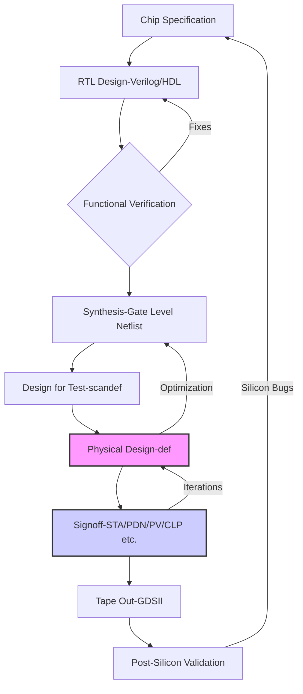

# ASIC Chip Design Flow: A Comprehensive Guide

### Table of Contents
* [[Chip Specification]]
* [[RTL Design|2. RTL Design]]
* [[Functional Verification|3. Functional Verification]]
* [[Synthesis|4. Synthesis]]
* [[Design for Test (DFT)|5. Design for Test (DFT)]]
* [[Physical Design (Backend)|6. Physical Design (Backend)]]
    * [[Pre-Placement & Sanity Checks|6.1. Pre-Placement & Sanity Checks]]
    * [[Floorplanning & Power Planning]]
    * [[Placement]]
    * [[Clock Tree Synthesis (CTS)|CTS]]
    * [[Routing |6.5. Routing]]
* [[Sign Off|7. Sign Off]]
    * [[STA|7.1. Static Timing Analysis (STA)]]
    * - [[Propagation Delay|Propagation Delay]]
    * [[Physical Verification]]
    * [[Engineering Change Order (ECO) in VLSI|7.4. ECO (Engineering Change Order)]]
* [[Tape Out & Manufacturing|8. Tape Out & Manufacturing]]
* [[Post-Silicon Validation|9. Post-Silicon Validation]]
* [[Recommended Resources]]
* [[Key File Formats]]
* [[Key EDA Tools|12. Key EDA Tools]]
* [[Frontend Interview Questions|13. Frontend Interview Questions]]
* [[Backend Interview Questions|14. Backend Interview Questions]]

### [[ASIC Design Flow]]
*A visual representation of the entire flow, including key inputs, outputs, and iteration loops.*

---
## 1. [[Chip Specification]]
*Where the idea and requirements for the ASIC are defined.*
- [[Functional Specification]]
- [[Microarchitecture]]
- [[Memory Hierarchy|Memory Hierarchy]]
- [[Register File|Register File]]
- [[Cache Coherency]]
- [[Pipeline Design]]
- [[Clock Frequency]]
    - [[PPA]]
- [[Cost Target]]
- [[I-O Specification]]
- [[PCIe]]
- [[DDR (Double Data Rate) SDRAM|DDR]]
- [[Modem]]
- [[Central Processing Unit (CPU)|CPU]]
- [[GPU]]
 
---
## 2. [[RTL Design]]
*Translating the microarchitecture into a hardware description language.*
- **[[HDL|Hardware Description Language (HDL)]]**
    - [[Verilog]]
    - [[VHDL]]
    - [[SystemVerilog]]
    - [[Finite State Machines (FSM)|FSM]]
    - [[Data Path Design]]
    - [[Control Logic]]
    - [[Combinational Logic]]
    - [[Digital Logic in VLSI|Digital Logic]]
    - [[Sequential Logic]]
    - [[Parameterization]]
    - [[IP Integration]]
    - [[Synthesizable vs Non-synthesizable constructs|Synthesizable vs Non-synthesizable constructs]]
    - [[Blocking vs Non-blocking Assignments|Blocking vs Non-blocking assignments]]
    - [[Latch Inference]]
- **[[Clock Domain Crossing (CDC)|Clock Domain Crossing (CDC)]]**
    - [[Metastability|Metastability]]
    - [[Synchronizers|Synchronizers]]
    - [[Handshake Protocol|Handshake Protocol]]
    - [[Asynchronous FIFOs]]
    - [[Reset Strategy]]
    - [[Synchronous Reset|Synchronous Reset]]
    - [[Asynchronous Reset in VLSI|Asynchronous Reset]]
    - [[Reset Synchronizer|Reset Synchronizer]]
- **[[Low Power Design|Low Power Design]]**
    - [[UPF|UPF (Unified Power Format)]]
    - [[Power Domains|Power Domains]]
    - [[Clock Gating|Clock Gating]]
    - [[Operand Isolation]]
    - [[Power Gating|Power Gating]]
    - [[Multi-voltage Design]]
    - [[Retention Cells]]
- **[[Linting]]**

---
## 3. [[Functional Verification]]
*Ensuring the RTL design behaves as intended before synthesis.*
- [[Testbench]]
- [[Simulation]]
- **[[Coverage Metrics]]**
    - [[Code Coverage]]
    - [[Functional Coverage|Functional Coverage]]
    - [[Assertion Coverage]]
- **[[Assertions in VLSI|Assertions]]**
    - [[SVA|SystemVerilog Assertions (SVA)]]
- **[[Verification Methodologies]]**
  - [[UVM|UVM (Universal Verification Methodology)]]
    - [[UVM Components]]
      - [[UVM Driver]]
      - [[UVM Monitor]]
      - [[UVM Sequencer|UVM Sequencer]]
      - [[UVM Agent|UVM Agent]]
      - [[UVM Scoreboard|UVM Scoreboard]]
      - [[UVM Scoreboard|UVM Scoreboard]]    
  - [[OVM (Open Verification Methodology)|OVM (Open Verification Methodology)]]
- **[[Advanced Verification in VLSI|Advance Verification]]**
    - [[Formal Verification]]
    - [[Emulation & Prototyping & FPGA]]
- **[[Test Techniques]]**
    - [[Directed Testing]]
    - [[Constrained Random Verification (CRV)|Constrained Random Verification]]
- **[[Low Power Verification|Low Power Verification]]**
  - [[Conformal Low Power (CLP) Checks|CLP]]
  - [[Power-Aware Formal Verification (PAFV)|PAFV | Power-aware Simulation]]
  - [[Logical Equivalence Checking (LEC)|LEC]]
---

## 4. [[Synthesis]]
*Converting RTL code into a technology-specific gate-level netlist.*
- [[Gate-Level Netlist]]
- [[Standard Cell Library|Standard Cell Library]]
- [[SDC|Synopsys Design Constraints (SDC)]]
- **[[Optimization Techniques]]**
    - [[Logic Optimization|Logic Optimization]]
    - [[Technology Mapping|Technology Mapping]]
    - [[Register Retiming|Register Retiming]]
    - [[Clock Gating|Clock Gating Insertion]]
    - [[WLM|WLM]]
- [[Physical Synthesis|Physical Synthesis]]
- [[Hierarchical Synthesis]]
  - [[Bottom-up Synthesis]]
  - [[Top-down Synthesis]]
  - [[Incremental Synthesis]]
- [[Low Power Synthesis|Low Power Synthesis, Power Management Features]]
  - [[Isolation Cells]]
  - [[Level Shifters|Level Shifters]]
  - [[Retention Cells]]
  - [[Multi-Vt Cells]]
  - [[UPF|Unified Power Format (UPF)]]
---

## 5. [[DFT|Design for Test (DFT)]]
*Adding logic to the design to facilitate manufacturing testability.*
- **[[DFT Principles]]**
  - [[Controllability]]
  - [[Observability]]
  - [[Repeatability]]
  - [[Survivability]]
- **[[Fault Models]]**
    - [[Stuck-at Faults|Stuck-at Faults]]
    - [[Transition Faults|Transition Faults]]
    - [[Bridging Faults]]
    - [[Open and Short Faults]]
- [[Scan Insertion]]
  - [[Scan Chains|Scan Chains]]
  - [[Scan Compression|Scan Compression]]
- [[Automatic Test Pattern Generation (ATPG)|ATPG (Automatic Test Pattern Generation)]]
- [[Test Coverage|Test Coverage]]
- **[[Built-In Self-Test (BIST)|BIST (Built-In Self-Test)]]**
    - [[Logic Built-In Self-Test (LBIST)|LBIST|Logic BIST (LBIST)]]
    - [[Memory Built-In Self-Test (MBIST)|MBIST|Memory BIST (MBIST)]]
- [[JTAG|Boundary Scan (JTAG)]]

---
## 6. [[Physical Design]]
*Creating the physical layout of the chip from the netlist.*

### 6.1. [[Pre-Placement & Sanity Checks]]
- [[Netlist Input]]
- **[[Sanity Checks|Sanity Checks]]**
    - [[Floating Nets and Pins in VLSI|Floating Nets and Pins]]
    - [[Multi-driven Nets]]
    - [[Combinational Loops|combinational loop]] in [[Digital Circuits|digital circuit]] design
    - [[Library Consistency|Library Consistency]]
    - [[SDC Checks]]
    - [[DRV Fixing in VLSI|DRV Fixing]]
- [[DFT Insertion]]

### 6.2. [[Floorplanning & Power Planning]]
- [[Partitioning|Partitioning]]
- [[Die Size Estimation in VLSI|Die Size Estimation]]
- [[Core Utilization in VLSI|Core Utilization]]
- [[Aspect Ratio in VLSI Physical Design|Aspect Ratio]]
- [[Macro Placement|Macro Placement]]
- [[Flylines]]
- [[Pin Assignment]]
- **[[Power Grid]]**
    - [[Power Mesh]]
    - [[Power Rings]]
    - [[Power Rails]]
- [[IR Drop]]
- **[[Placement Blockages]]**
    - [[Hard Blockage|Hard Blockage]]
    - [[Soft Blockage|Soft Blockage]]
    - [[Partial Blockage|Partial Blockage]]
    - [[Halo (Keep Out Margins)|Halo,Keep Out Margins]]
- **[[Files]]**
    - [[Design Exchange Format (DEF)|DEF]]
    - [[LEF (Library Exchange Format)|LEF (Library Exchange Format)]]

### 6.3. [[Placement]]
- [[Standard Cell Placement]]
- **[[Placement Optimization]]**
    - [[Timing-driven Placement]]
    - [[Power-driven Placement]]
    - [[Congestion-driven Placement]]
- [[Congestion Analysis]]
- [[Cell Density]]
- [[Legalization]]
- [[High-Fanout Net Synthesis (HFNS)]]
- [[Scan Chain Reordering]]
- **[[Physical-Only Cells]]**
    - [[Tap Cells]]
    - [[Endcap Cells]]
    - [[Decaps in VLSI|Decoupling Capacitors (Decaps)]]
    - [[Tie Cells]]

### 6.4. [[CTS|Clock Tree Synthesis (CTS)]]
- [[Clock Skew]]
- [[Insertion Delay]]
- [[Clock Latency]]
- [[Clock Uncerainity | Clock Uncertainty, Clock Jitter]]
- [[Useful Skew|Useful Skew]]
    - [[NDR]]
- [[Clock Shielding in VLSI|Clock Shielding]]
- [[Clock Gating|Clock Gating]]
- [[Clock Buffers and Inverters]]
- **[[Clock Tree Architectures]]**
    - [[H-Tree]]
    - [[Conventional Clock Tree Synthesis (CTS)|Conventional CTS]]
        - [[Clock Mesh]]
    - [[MSCTS]]

### 6.5. [[Routing]]
- [[Global Routing]]
- [[Detailed Routing|Detailed Routing]]
- **[[Routing Optimizations|Routing Optimizations]]**
    - [[Timing-Driven Routing]]
    - [[Signal Integrity]]
    - [[Crosstalk in VLSI|Crosstalk]]
    - [[Antenna Effect in VLSI|Antenna Effect]]
- [[Metal Fill]]
- [[Routing Layers|Routing Layers]]

---
## 7. [[Sign Off]]
*Final verification checks before manufacturing.*

### 7.1. [[STA|Static Timing Analysis (STA)]]
*Analyzing timing paths to ensure the design meets timing and frequency requirements across all PVT conditions.*
- **[[STA Tools]]**
  - [[PrimeTime]]
  - [[Tempus|Tempus]]
  - [[Tweaker|Tweaker]]
- **[[Inputs]]**
  - [[Netlist]]
  - [[Timing Library]]
  - [[SPEF|Parasitic Files]]
  - [[SDF|Standard Delay Format]]
  - [[Timing Window File]]
  - [[Constraints]]
- **[[Timing Reports | Key outputs, Timing Reports]]**
  - [[report_qor|report_qor]]
  - [[report_timing|report_timing]]
  - [[report_clock_timing|report_clock_timing]]
  - [[report_delay_calculation|report_delay_calculation]]
  - [[report_noise|report_noise]]
- **[[Constraint Verification]]**
  - [[check_timing Command in STA|check_timing]]
  - [[report_constraint|report_constraint]]
  - [[report_exceptions|report_exceptions]]
  - [[report_annotated_parasitics|report_annotated_parasitics]]
  - [[report_analysis_coverage|report_analysis_coverage]]
  - [[Linking Checks|Linking Checks]]
  - [[Unclocked Flops|Unclocked Flops]]
  - [[Unclocked Flops|Unclocked Flops]]
  - [[Unconstrained Endpoints|Unconstrained Endpoints]]
- **[[Timing Analysis]]**
  - [[Graph-Based Analysis]]
  - [[Path-Based Analysis]]
  - [[Clocks]]
    - [[Clock Groups]]
    - [[Clock Types | Clock Type, Generated, Virtual etc.]]
    - [[Clock Insertion Delay]]
    - [[CDC| Clock Domain Crossing, Clock Muxing]]
  - [[Timing Paths|Timing Paths]]
    - [[Data and clock Path]]
    - [[Launch and Capture Path|Launch and Capture Path]]
    - [[Timing Paths | reg2reg, in2reg, reg2out, in2out]]
  - [[Timing Exceptions]]
    - [[False Paths in STA|False Paths]]
    - [[Multicycle Paths]]
    - [[Half cyle paths]]
    - [[Delay in VLSI|Delay Exceptions | set_max_delay,set_min_delay]]
  - [[Operating Modes]]
    - [[Functional Mode]]
    - [[Test Mode | Test Mode, Scan, Shift, and Capture]]
  - [[PVT Corners]]
  - [[Hierarchical vs. Flat STA]]
  - [[DVFS | Dynamic Voltage and Frequency Scaling]]
  - [[SMVA|Simultaneous Multivoltage Analysis]]
  - [[Timing Violations]]
      - [[Setup|Setup Time]]
      - [[Hold Time|Hold]]
      - [[Recovery|Recovery]]
      - [[Removal|Removal]]
      - [[MPW]]
      - [[Min Period|Minimum Period]]
      - [[DCD in VLSI|DCD]]
      - [[Clock Gating Setup|Clock Gating Setup]]
      - [[Clock Gating Hold|Clock Gating Hold]]
      - [[Delay Exception|Max-Min Path Delay]]
      - [[Skew Checks|Maximum Skew]]
    - [[Race Conditions|Race Conditions]]
    - [[Timing Design Rule Violations]]
      - [[Transition|Transition]]
      - [[Fall Time|Fall Time]]
      - [[Capacitance in VLSI|Capacitance]]
      - [[Max Fanout|Max Fanout]]
    - [[Signal Integrity Analysis]]
      - [[Crosstalk Delay]]
      - [[Noise]]
      - [[SI Double Switching|SI Double Switching]]
  - [[Delay Models in VLSI|Delay Models]]
    - [[NLDM | Non-Linear Delay Model]]
    - [[CCS | Composite Current Source]]
    - [[ECSM | Effective Current Source Model]]

- **[[Variability Analysis]]**
  - [[Process Variation|Process Variation]]
  - [[BC-WC|Best-Case - Worst-Case Analysis]]
  - [[OCV]]
  - [[AOCV|Advanced OCV]]
  - [[POCV|Parametric OCV]]
  - [[CRPR Or CPPR|Clock Reconvergence Pessimism Removal]]
  
- **[[Timing ECO]]**
  - [[Manual ECO]]
  - [[Tool Assisted ECO]]
  - [[Fixing Techniques]]
    - [[Cell Sizing]]
    - [[Buffer Insertion]]
    - [[Clock Path ECO]]
    - [[Vt Swapping]]
    - [[Metal ECO | Wire Optimization]]
    - [[Frequency Optimization]]
    - [[Common Path Optimization ]]
    - [[Logic Cloning]]

### 7.2. [[Power Signoff]]
*Ensuring power integrity, reliability, and compliance in low-power, multi-voltage designs.*

- **[[Power Fundamentals]]**
  - [[Power Types]]
    - [[Dynamic Power in VLSI|Dynamic Power | Dynamic Power - Switching, Internal]]
    - [[Static Power | Static Power - Leakage]]
  - [[Power Metrics & Calculation]]
    - [[Total Power|Total Power]]
    - [[Early Power Estimation in VLSI|Early Power Estimation]]
- **[[Power Delivery Network (PDN)]]**
  - [[PDN Components]]
    - [[Power Grid | Power Grid, Straps, Vias, Decaps]]
    - [[Power Straps|Power Straps]]
    - [[PCB Power Grid | Voltage Regulators, Supply Sets]]
- **[[Power Integrity Analysis]]**
  - [[Resistance Limits]]
  - [[IR Drop Analysis]]
    - [[Static IR Drop]]
    - [[Dynamic IR Drop | Dynamic IR Drop - Vectorless or VCD]]
    - [[DFT Power Signoff|DFT Power Signoff]]
  - [[Electromigration in VLSI|Electromigration | EM Analysis - Power, Signal]]
  - [[Decap Planning in VLSI|Decap Planning]]
  - [[IR Drop Aware Timing Signoff]]
  - [[Power Supply Noise|Power Supply Noise]]
  - [[Package Modeling | Package or Board Modeling and Signoff]]
- **[[Power Management Techniques]]**
  - [[In-rush Current]]
  - [[Power Gating|Power Gating]]
  - [[State Retention]]
    - [[Retention Registers|Retention Registers]]
    - [[Power Muxing]]
- **[[Tool Flow & Signoff]]**
  - [[PDN Tools | PDN Tools - RedHawk-SC, Voltus, PrimeRail]]
  - [[PDN Inputs | PDN Inputs LEF, DEF, LIB, SPEF, VCD, etc.]]
  - [[Package Tools | Package Tools - SiWave, Totem, etc.]]
  - [[Low Power Signoff]]
  

### 7.3. [[Physical Verification]]
- [[Design Rule Check (DRC)|DRC]]
- [[LVS (Layout Versus Schematic)|LVS - Layout Versus Schematic]]
- [[Antenna Effect in VLSI|Antenna Effect]]
- [[Electrical Rule Check (ERC)|ERC]]
- [[DFM|DFM - Design for Manufacturability]]
- [[Density Checks in VLSI|Density_Checks]]
- [[Metal Fill Verification|Metal_Fill_verification]]
- [[Double Patterning Check (DPC) in VLSI|Double_Patterning_Check]]
- [[ESD Checks|ESD_Checks]]
- [[Physical Verification Tools (PV_Tools)|PV_Tools]]

### 7.4. [[ECO|ECO - Engineering Change Order]]
- [[Functional ECO]]
- [[Timing ECO|Timing ECO]]
- [[Metal-Only ECO|Metal-Only ECO]]
- [[Spare Cells|Spare Cells]]

---
## 8. [[Tape Out & Manufacturing]]
*Sending the final design to the foundry.*
- [[GDSII or OASIS]]
- [[Foundry]]
  - [[TSMC|TSMC]]
  - [[Samsung|Samsung]]
  - [[Intel]]
- [[Mask Generation|Mask Generation]]
- [[Wafer Sort|Wafer Sort]]
- [[Packaging]]

---
## 9. [[Post-Silicon Validation]]
*Testing the manufactured chip in a lab environment.*
- [[Bring-Up in VLSI|Bring-Up]]
- [[Characterization]]
- [[Shmoo Plots|Shmoo Plots]]
- [[Automatic Test Equipment (ATE)|ATE]]
- [[Failure Analysis|FA - Failure Analysis]]
- [[Yield Analysis|Yield Analysis]]

---
## 10. [[Recommended Resources]]

### Books
- **Digital Design & Computer Architecture**
    - *Computer Architecture: A Quantitative Approach* by John L. Hennessy & David A. Patterson
    - *Digital Design and Computer Architecture* by David Money Harris & Sarah L. Harris
    - *Computer Organization and Design* by David A. Patterson & John L. Hennessy
- **HDL (Verilog/VHDL/SystemVerilog)**
    - *Digital Design: With an Introduction to the Verilog HDL, VHDL, and SystemVerilog* by M. Morris Mano & Michael D. Ciletti
    - *RTL Modeling with SystemVerilog for Simulation and Synthesis* by Stuart Sutherland
    - *The Designer's Guide to VHDL* by Peter J. Ashenden
- **Functional Verification & UVM**
    - *SystemVerilog for Verification: A Guide to Learning the Testbench Language Features* by Chris Spear
    - *The UVM Primer: A Step-by-Step Introduction to the Universal Verification Methodology* by Ray Salemi
    - *Cracking Digital VLSI Verification Interview* by Ramdas Mozhikunnath
- **Synthesis & Static Timing Analysis (STA)**
    - *Advanced ASIC Chip Synthesis: Using Synopsys® Design Compiler™ and PrimeTime®* by Himanshu Bhatnagar
    - *Constraining Designs for Synthesis and Timing Analysis: A Practical Guide to Synopsys Design Constraints (SDC)* by Sridhar Gangadharan & Sanjay Churiwala
    - *Static Timing Analysis for Nanometer Designs: A Practical Approach* by J. Bhasker & Rakesh Chadha
    - *Logic Synthesis and Verification* by Soha Hassoun & Tsutomu Sasao
- **Physical Design**
    - *Physical Design Essentials: An ASIC Design Implementation Perspective* by Khosrow Golshan
    - *CMOS VLSI Design: A Circuits and Systems Perspective* by Neil Weste & David Harris
- **Power Integrity**
    - *Power Integrity Analysis and Management for Integrated Circuits* by Raj Nair & Donald Bennett
    - *The Printed Circuit Designer's Guide to Power Integrity by Example* by Fadi Deek
- **Design for Test (DFT) & Post-Silicon Validation**
    - *Post-Silicon Validation and Debug* by Prabhat Mishra & Farimah Farahmandi
    - *The Small Book About Design-for-Test* by Juergen Alt
    - *VLSI Test Principles and Architectures* by Laung-Terng Wang, Cheng-Wen Wu, & Xiaoqing Wen

### Websites & Blogs
- [ChipEdge](https://chipedge.com/)
- [Wilson Snyder's Verilator Page](https://www.veripool.org/verilator/)
- [Sutherland HDL](https://www.sutherland-hdl.com/)
- [SemiEngineering](https://semiengineering.com/)
- [Signoff Semiconductor](https://signoffsemiconductors.com/)
- [IEEE Xplore](https://ieeexplore.ieee.org/)
- [VLSI System Design](https://www.vlsisystemdesign.com/)
- [VLSI Expert](https://www.vlsiexpert.com/)
- [Team VLSI](https://teamvlsi.com/)

---
## 11. [[Key File Formats]]
| Extension(s) | Full Name | Description |
|---|---|---|
| `.v`, `.vh`, `.sv`, `.svh` | [[Verilog]] / [[SystemVerilog]] | [[RTL]] or [[Gate-Level Netlist]] |
| `.vhd`, `.vhdl` | [[VHDL]] | [[RTL]] or [[Gate-Level Netlist]] |
| `.sdc` | [[SDC|Synopsys Design Constraints]] | Timing, power, and area constraints |
| `.lib`, `.db` | Liberty [[Timing Library]] | Standard cell timing and power models |
| `.lef` | [[LEF|Library Exchange Format]] | Physical abstract view of cells/macros |
| `.def` | [[DEF|Design Exchange Format]] | Physical layout data (placement, routing) |
| `.spef` | [[SPEF|Standard Parasitic Exchange Format]] | Extracted parasitic R and C values |
| `.gds`, `.gdsii`, `.oas` | [[GDSII or OASIS]] | Final layout database for manufacturing |
| `.upf`, `.cpf` | [[UPF|Unified]]/[[CPF|Common Power Format]] | Low-power design intent |
| `.tf` | [[Technology File|Technology File]] | Foundry process layer information |
| `.vcd`, `.saif` | [[Activity Vectors]], Value Change Dump , SAIF | Switching activity for power analysis |

---
## 12. [[Key EDA Tools]]
| Design Stage | Synopsys | Cadence | Siemens EDA |
|---|---|---|---|
| **[[RTL Design]]** | VCS | Xcelium | Questa |
| **[[Synthesis]]** | Fusion Compiler, Design Compiler | Genus | Tessent Synthesis |
| **[[Formal Verification]]** | Formality | Conformal LEC | Tessent Formal |
| **[[STA|Static Timing Analysis (STA)]]** | PrimeTime (PT) | Tempus | Tessent Shell with STA |
| **[[CTS Tools|CTS]]** | PrimeTime (PT) | Tempus | Tessent Shell with STA |
| **[[CTS Tools|CTS]]** | PrimeTime (PT) | Tempus | Tessent Shell with STA |
| **[[CTS Tools|CTS]]** | PrimeTime (PT) | Tempus | Tessent Shell with STA |
| **[[DFT|Design for Test (DFT)]]** | TestMAX | Modus | Tessent |
| **[[Physical Design]]** | IC Compiler II (ICC2) | Innovus | Aprisa |
| **[[SPEF|Parasitic Extraction]]** | StarRC | Quantus | Calibre xACT |
| **[[Physical Verification]] (DRC/LVS)** | IC Validator (ICV), Hercules | Pegasus | Calibre |
| **[[Power Signoff]]** | PrimePower, RedHawk (Ansys) | Voltus | Calibre PERC, mPower |

---
## 13. [[Frontend Interview Questions]]
*Basic Questions for each topic for checking the knowledge level. Do you know them all?*
- **[[RTL Design]]**
    - Explain the difference between [[Verilog]] and [[SystemVerilog]].
    - Design a synchronous [[Asynchronous FIFOs|FIFO]].
    - How do you handle [[CDC|Clock Domain Crossing (CDC)]]?
    - What is the difference between [[Blocking vs Non-blocking assignments|blocking and non-blocking assignments]]?
    - Design a Mealy Machine and a Moore Machine for a given sequence detector.
- **[[Verification]]**
    - What are the main components of a [[UVM|UVM testbench]]?
    - Explain the difference between [[Functional Coverage]] and [[Code Coverage]].
    - What is an [[SVA|assertion]]? Give an example.
    - What is [[Constrained Random Verification]]?
- **[[Synthesis]]**
    - What happens during [[Logic Optimization|Logic Synthesis]]?
    - What is a [[WLM|wire load model]]? Why is it inaccurate?
    - Explain what a [[critical path]] is.
    - How can you reduce [[Dynamic Power]] in your RTL code?

---
## 14. [[Backend Interview Questions]]
- **[[Physical Design]]**
    - What are the inputs and outputs of the [[Floorplanning & Power Planning|floorplanning]] stage?
    - What is [[Congestion Analysis|routing congestion]] and how do you fix it?
    - Explain the goals of [[CTS|Clock Tree Synthesis (CTS)]].
    - What is the difference between [[Global Routing]] and [[Detailed Routing]]?
- **[[STA|Static Timing Analysis (STA)]]**
    - Explain [[Setup]] and [[Hold]].
    - How do you fix a [[Setup|setup violation]]? How do you fix a [[Hold|hold violation]]?
    - Why is [[Hold]] independent of the clock period?
    - What is the difference between [[BC-WC|Best-Case - Worst-Case Analysis]] analysis and [[OCV|OCV]]?
    - Explain the concept of [[PVT Corners]]. Why do we need to close timing on all of them?
    - Explain [[Crosstalk Delay]] and [[Noise|Crosstalk Glitch]]. How does crosstalk affect setup and hold?
    - What is [[Useful Skew]] and how can it be used to help fix setup violations?
    - What are Max [[Transition]] and Max [[Capacitance]] violations, and how do you fix them?
    - What is the difference between [[AOCV|AOCV]] and [[POCV|POCV]]?
    - Describe how you would debug a [[Timing Paths|timing path]]. What information do you look for in the report?
- **[[Power Signoff]] & [[Physical Verification]]**
    - What is [[IR Drop]]? Differentiate between static and dynamic IR drop.
    - What is [[Electromigration|electromigration (EM)]]?
    - What is the difference between [[DRC|DRC]] and [[LVS|LVS]]?
    - What is the [[Antenna Effect]] and how is it fixed?
- **[[ECO]]**
    - When would you perform an [[ECO|ECO]]?
    - What is a [[Metal-Only ECO]] and why is it preferred?
