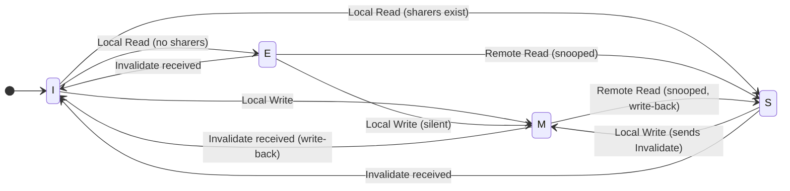

In a multi-core system ([[CPU]], [[GPU]]) where processors share memory but have private caches, [[Cache Coherency]] is the mechanism that ensures all cores have a consistent and correct view of the shared data. It prevents data corruption that occurs when one core modifies data in its local cache while others use an old, stale version.

### Key Specification Points
*   **Protocol Selection**: The specific coherency protocol to be implemented. Common choices are invalidate-based protocols from the MESI family:
    *   **MSI** (Modified, Shared, Invalid): A simple, foundational protocol.
    *   **MESI** (Modified, Exclusive, Shared, Invalid): The most widely used protocol, adding an "Exclusive" state to optimize writes to unshared data.
    *   **MOESI** (Modified, Owned, Exclusive, Shared, Invalid): An enhancement that adds an "Owned" state to optimize sharing of modified data and reduce write-backs.
*   **Coherence States**: The protocol defines the state for each cache line (the unit of data). For MESI:
    *   **Modified (M)**: The only valid copy, has been modified (is dirty). Must be written back to memory.
    *   **Exclusive (E)**: The only valid copy, is clean (matches memory).
    *   **Shared (S)**: Multiple clean copies may exist in different caches.
    *   **Invalid (I)**: The data is not valid.
*   **Coherency Mechanism**: How the protocol is implemented:
    *   **Snooping**: Cache controllers monitor (snoop) a shared bus for transactions and update their states accordingly. Common in smaller systems.
    *   **Directory-based**: A central directory tracks the state and sharers of every cache line. More scalable for many-core systems.

### MESI Protocol State Machine

## Further Reading

*   **Computer Architecture: A Quantitative Approach** by John L. Hennessy & David A. Patterson
*   **Computer Organization and Design** by David A. Patterson & John L. Hennessy
*   [Wikipedia - Cache Coherence](https://en.wikipedia.org/wiki/Cache_coherence)
*   [GeeksforGeeks - Cache Coherence Protocols](https://www.geeksforgeeks.org/cache-coherence-protocols/)