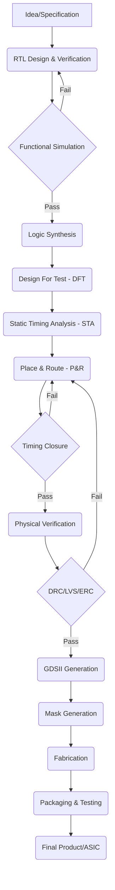

# ASIC Design Flow: A Comprehensive Guide

## **Table of Contents**

1. [Introduction](#introduction)
2. [ASIC Design Flow Chart](#asic-design-flow-chart)
3. [ASIC Design Flow Stages](#asic-design-flow-stages)
    *   [Idea/Specification](#1-ideaspecification)
    *   [RTL Design & Verification](#2-rtl-design--verification)
    *   [Functional Simulation](#3-functional-simulation)
    *   [Logic Synthesis](#4-logic-synthesis)
    *   [Design For Test (DFT)](#5-design-for-test-dft)
    *   [Static Timing Analysis (STA)](#6-static-timing-analysis-sta)
    *   [Place & Route (P\&R)](#7-place--route-pr)
    *   [Timing Closure](#8-timing-closure)
    *   [Physical Verification](#9-physical-verification)
    *   [GDSII Generation](#10-gdsii-generation)
    *   [Mask Generation](#11-mask-generation)
    *   [Fabrication](#12-fabrication)
    *   [Packaging & Testing](#13-packaging--testing)
    *   [Final Product/ASIC](#14-final-productasic)
4. [Conclusion](#conclusion)

## Introduction

Application-Specific Integrated Circuits (ASICs) are custom-designed integrated circuits (ICs) tailored for a specific application. Unlike general-purpose ICs like microprocessors, ASICs are optimized for a single task, offering superior performance, power efficiency, and size advantages for that particular function.

This document outlines the standard ASIC design flow, a step-by-step process that transforms an initial idea into a fabricated and tested physical chip.

## ASIC Design Flow Chart

## ASIC Design Flow Stages

Here's a detailed breakdown of each stage in the ASIC design flow:

### 1. Idea/Specification

*   **Concept Definition:** The process begins with a clear idea for the ASIC's functionality, target application, and performance goals.
*   **Requirements Gathering:** Detailed specifications are created, outlining:
    *   **Functionality:** What the chip should do.
    *   **Performance:** Speed, throughput, latency requirements.
    *   **Power:** Power consumption limits (dynamic and static power).
    *   **Area:** Physical size constraints.
    *   **Interface:** How the ASIC will interact with other components (e.g., protocols like I2C (Inter-Integrated Circuit), SPI (Serial Peripheral Interface), PCIe (Peripheral Component Interconnect Express)).
    *   **Technology Node:** The fabrication process technology (e.g., 28nm, 14nm, 7nm).
    *   **Cost:** Target manufacturing cost.
*   **Feasibility Study:** An initial assessment to determine if the proposed ASIC is technically and economically viable.

**Tools & Vendors:**

*   **Requirement Management:** DOORS (IBM), Jama Connect (Jama Software), Polarion (Siemens)
*   **Spreadsheets & Documents:** Microsoft Excel, Microsoft Word, Google Sheets, Google Docs

### 2. RTL Design & Verification

*   **Register Transfer Level (RTL) Design:** The ASIC's behavior is described using a Hardware Description Language (HDL) like Verilog or VHDL (VHSIC Hardware Description Language). RTL code defines the flow of data between registers and the operations performed on that data in each clock cycle.
*   **Design Partitioning:** For large designs, the RTL is divided into smaller, manageable modules.
*   **IP (Intellectual Property) Core Integration:** Pre-designed and verified blocks (IP cores) like memory controllers or standard interfaces can be integrated to accelerate the design process.
*   **RTL Verification:** Ensuring the RTL code accurately implements the desired functionality.
    *   **Testbench Creation:** A test environment is built to stimulate the RTL design with various inputs and scenarios.
    *   **Functional Simulation:** The RTL code is simulated using an HDL simulator to verify its behavior against the specification.
    *   **Code Coverage:** Metrics are used to measure how thoroughly the testbench exercises the RTL code (e.g., statement coverage, branch coverage, toggle coverage, FSM (Finite State Machine) coverage).
    *   **Assertion-Based Verification (ABV):** Formal properties and assertions are written to specify design intent and detect potential bugs using SystemVerilog Assertions (SVA) or Property Specification Language (PSL).
    *   **Formal Verification:** Using mathematical techniques to prove that the RTL design meets its specification without the need for exhaustive simulation.

**Tools & Vendors:**

*   **RTL Design & Simulation:**
    *   Questa (Siemens EDA)
    *   VCS (Synopsys)
    *   Xcelium (Cadence)
    *   ModelSim (Siemens EDA)
    *   Verilator (Open Source)
*   **Verification IPs:**
    *   Synopsys, Cadence, Siemens EDA
*   **Code Coverage:**
    *   Questa Coverage (Siemens EDA)
    *   vManager (Synopsys)
    *   Indago (Cadence)
*   **Formal Verification:**
    *   JasperGold (Cadence)
    *   Questa Formal (Siemens EDA)
    *   VC Formal (Synopsys)

### 3. Functional Simulation

*   The RTL code, along with the testbench, is simulated using an HDL simulator.
*   The simulator executes the design cycle by cycle, applying the input stimuli from the testbench and generating the corresponding outputs.
*   Waveforms are generated and analyzed to check if the design behaves as expected.
*   If the simulation passes, the flow proceeds to logic synthesis. If it fails, the RTL code needs to be debugged and corrected.

**Tools & Vendors:**

*   **HDL Simulators:**
    *   Questa (Siemens EDA)
    *   VCS (Synopsys)
    *   Xcelium (Cadence)
    *   ModelSim (Siemens EDA)
    *   Verilator (Open Source)

### 4. Logic Synthesis

*   **Translation:** The RTL code is translated into a gate-level netlist, a description of the circuit using logic gates (AND, OR, XOR, etc.) and flip-flops.
*   **Technology Mapping:** The generic logic gates are mapped to specific cells from a standard cell library provided by the target technology (e.g., a 28nm library).
*   **Optimization:** The synthesis tool optimizes the netlist for area, speed, and power, based on the specified constraints.
*   **Constraints:** Synthesis constraints guide the optimization process. They include:
    *   **Clock Definition:** Specifies the clock frequency and other clock characteristics.
    *   **Timing Constraints:** Defines the timing requirements for the design (e.g., setup time, hold time). Usually written in Synopsys Design Constraints (SDC) format.
    *   **Area Constraints:** Limits the total area used by the design.
    *   **Power Constraints:** Specifies the maximum power consumption allowed.

**Tools & Vendors:**

*   **Logic Synthesis:**
    *   Design Compiler (Synopsys)
    *   Genus Synthesis Solution (Cadence)
    *   Precision RTL Synthesis (Siemens EDA)

### 5. Design For Test (DFT)

*   **Testability Enhancement:** DFT techniques are employed to make the chip easier to test after fabrication.
*   **Scan Chains:** Flip-flops are connected into scan chains, allowing test patterns to be shifted in and test responses to be shifted out.
*   **Automatic Test Pattern Generation (ATPG):** Tools are used to automatically generate test patterns that achieve high fault coverage (the percentage of faults that can be detected by the test patterns).
*   **Built-In Self-Test (BIST):** Logic is added to the chip to allow it to test itself, reducing the need for external testing equipment.
*   **Memory BIST (MBIST):** Specific BIST for testing embedded memories.
*   **Boundary Scan (JTAG - Joint Test Action Group):** A standard interface (IEEE 1149.1) for testing the connections between the ASIC and other components on a board.

**Tools & Vendors:**

*   **DFT Insertion & ATPG:**
    *   Tessent (Siemens EDA)
    *   DFTMAX, TetraMAX (Synopsys)
    *   Encounter Test (Cadence)

### 6. Static Timing Analysis (STA)

*   **Timing Verification:** STA is a method to verify the timing performance of the design without performing simulations. It's a static analysis technique that checks all possible timing paths.
*   **Path Analysis:** STA analyzes all timing paths in the design to ensure they meet the specified timing constraints.
*   **Setup and Hold Time Checks:** STA verifies that signals arrive at flip-flops within the required setup and hold time windows.
*   **Clock Skew Analysis:** STA checks for excessive clock skew (the difference in arrival times of the clock signal at different flip-flops), which can cause timing violations.
*   **False Paths and Multicycle Paths:** STA identifies paths that are not critical for timing (false paths) or require multiple clock cycles to propagate (multicycle paths) and can be excluded from analysis for better timing optimization.

**Tools & Vendors:**

*   **STA:**
    *   PrimeTime (Synopsys)
    *   Tempus (Cadence)
    *   Questa STA (Siemens EDA)

### 7. Place & Route (P&R)

*   **Floorplanning:** The initial planning of the chip's layout, including the placement of major blocks, I/O (Input/Output) pads, and power grids.
*   **Placement:** The process of placing the standard cells from the gate-level netlist onto the chip layout.
*   **Clock Tree Synthesis (CTS):** Building a balanced clock distribution network to minimize clock skew.
*   **Routing:** Connecting the placed cells with metal wires according to the netlist.
*   **Optimization:** The P\&R tool iteratively optimizes the placement and routing to meet timing, area, and power goals.

**Tools & Vendors:**

*   **P\&R:**
    *   IC Compiler II (Synopsys)
    *   Innovus Implementation System (Cadence)
    *   Aprisa (Siemens EDA)

### 8. Timing Closure

*   **Iterative Process:** Timing closure is an iterative process that involves analyzing STA reports, identifying timing violations, and making adjustments to the design or constraints to fix them.
*   **Techniques:** Common techniques for achieving timing closure include:
    *   **Logic Optimization:** Resizing gates, restructuring logic.
    *   **Placement Optimization:** Adjusting cell placement to reduce wire delays.
    *   **Routing Optimization:** Modifying routing to improve timing.
    *   **Clock Tree Optimization:** Fine-tuning the clock tree to minimize skew.
    *   **Constraint Refinement:** Adjusting timing constraints if necessary.
*   If timing closure cannot be achieved, it might be necessary to go back to earlier stages of the design flow, such as RTL design or logic synthesis.

**Tools & Vendors:**

*   **Logic Optimization/ECO (Engineering Change Order):**
    *   PrimeTime (Synopsys)
    *   Tempus (Cadence)
    *   Genus Synthesis Solution (Cadence)
    *   Design Compiler (Synopsys)
*   **Placement/Routing Optimization:**
    *   IC Compiler II (Synopsys)
    *   Innovus Implementation System (Cadence)

### 9. Physical Verification

*   **Design Rule Check (DRC):** Verifying that the layout meets the manufacturing process's design rules (e.g., minimum spacing between wires, minimum transistor sizes).
*   **Layout Versus Schematic (LVS):** Comparing the layout to the gate-level netlist to ensure they are logically equivalent.
*   **Electrical Rule Check (ERC):** Checking for electrical issues in the layout, such as short circuits, open circuits, and antenna violations (charge accumulation during manufacturing that can damage gates).

**Tools & Vendors:**

*   **Physical Verification:**
    *   Calibre (Siemens EDA)
    *   Assura (Cadence)
    *   PVS (Synopsys)

### 10. GDSII Generation

*   **Layout Database:** The final, verified layout is converted into the GDSII (Graphic Design System II) format, a standard format for representing IC layout data.
*   **Tapeout:** The GDSII file is sent to the foundry for mask generation. This step is commonly referred to as "tapeout."

**Tools & Vendors:**

*   **Layout Editors:**
    *   IC Compiler II (Synopsys)
    *   Innovus Implementation System (Cadence)
    *   Custom Compiler (Synopsys)
    *   Virtuoso (Cadence)

### 11. Mask Generation

*   **Photomasks:** The foundry uses the GDSII data to create photomasks, which are used to pattern the different layers of the integrated circuit during fabrication.

**Vendors:**

*   **Mask Shops:** Toppan Photomasks, Dai Nippon Printing (DNP), Photronics

### 12. Fabrication

*   **Wafer Processing:** The ASIC is fabricated on silicon wafers in a semiconductor fabrication plant (fab). This involves a complex sequence of steps, including:
    *   **Deposition:** Laying down thin films of various materials (e.g., silicon dioxide, polysilicon, metal).
    *   **Lithography:** Transferring patterns from the photomasks onto the wafer using light.
    *   **Etching:** Removing unwanted material to create the desired patterns.
    *   **Ion Implantation:** Introducing dopants into the silicon to alter its electrical properties.
    *   **Chemical Mechanical Polishing (CMP):** Planarizing the wafer surface.

**Vendors:**

*   **Foundries:** TSMC (Taiwan Semiconductor Manufacturing Company), Samsung, GlobalFoundries, Intel

### 13. Packaging & Testing

*   **Die Preparation:** The fabricated wafer is diced into individual chips (dies).
*   **Packaging:** Each die is mounted in a package that provides electrical connections, mechanical support, and protection. Common package types include Ball Grid Array (BGA), Quad Flat Package (QFP), and Flip Chip.
*   **Testing:** The packaged ASICs are tested to ensure they meet the specifications. This includes:
    *   **Functional Testing:** Verifying that the chip performs its intended function.
    *   **Performance Testing:** Measuring the chip's speed and power consumption.
    *   **Burn-in:** Operating the chip at elevated temperatures and voltages to screen out early failures (infant mortality).

**Tools & Vendors:**

*   **Automated Test Equipment (ATE):**
    *   Teradyne
    *   Advantest
    *   Cohu

### 14. Final Product/ASIC

*   The tested and packaged ASICs are ready to be integrated into the final product.

## Conclusion

The ASIC design flow is a complex and iterative process that requires expertise in various domains, including digital design, verification, physical design, and testing. By carefully following each stage of the flow, engineers can successfully create custom-designed integrated circuits that meet the specific requirements of their target applications. This detailed explanation, along with the flow chart, should provide a solid foundation for university students learning about ASIC design. Please let me know if you have any further questions.
