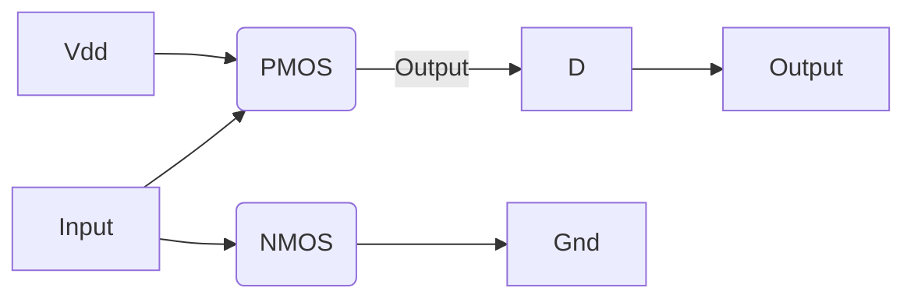
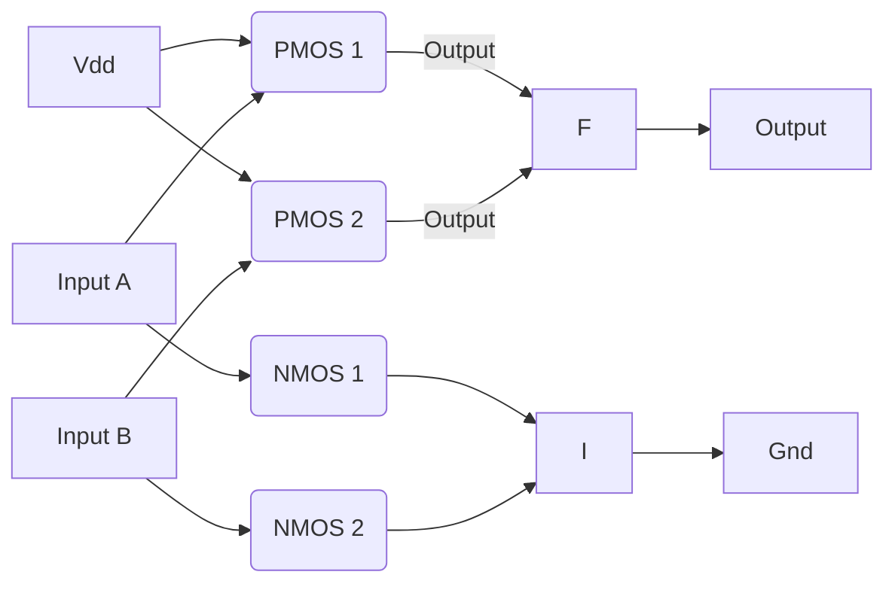
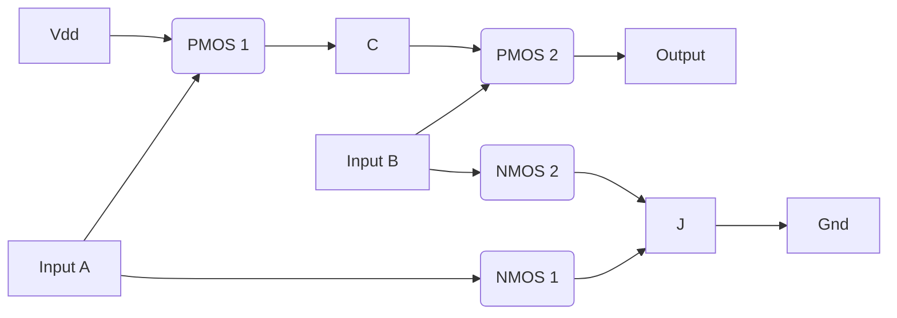
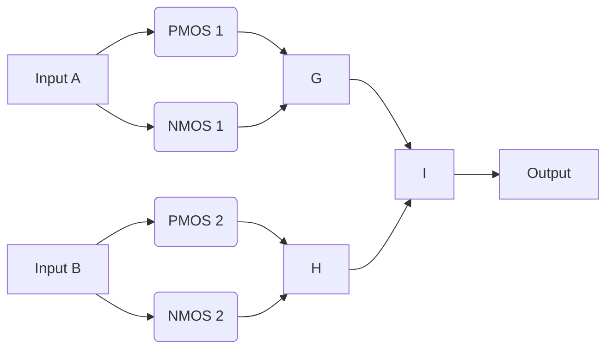

# Circuits: Gates and Transistor-Level Implementation: A Deep Dive

## Table of Contents

1.  [Introduction to Logic Gates](#introduction-to-logic-gates)
2.  [Transistor-Level Implementation](#transistor-level-implementation)
    *   [MOSFETs: The Fundamental Devices](#mosfets-the-fundamental-devices)
        *   [NMOS Transistor Detailed Operation](#nmos-transistor-detailed-operation)
        *   [PMOS Transistor Detailed Operation](#pmos-transistor-detailed-operation)
        *   [Threshold Voltage (Vt)](#threshold-voltage-vt)
        *    [Transistor Regions of Operation](#transistor-regions-of-operation)
    *   [CMOS Inverter: Detailed Analysis](#cmos-inverter-detailed-analysis)
        *   [Static Behavior](#static-behavior)
        *   [Dynamic Behavior](#dynamic-behavior)
        *   [Switching Characteristics](#switching-characteristics)
    *   [CMOS NAND Gate: Detailed Analysis](#cmos-nand-gate-detailed-analysis)
         *   [Static Behavior](#static-behavior-nand)
        *   [Dynamic Behavior](#dynamic-behavior-nand)
        *   [Switching Characteristics](#switching-characteristics-nand)
    *   [Other CMOS Logic Gates](#other-cmos-logic-gates)
        *   [CMOS NOR Gate](#cmos-nor-gate)
        *   [CMOS XOR and XNOR Gates](#cmos-xor-and-xnor-gates)
3. [Advanced Topics and Considerations](#advanced-topics-and-considerations)
    *   [Transistor Sizing](#transistor-sizing)
    *  [Layout Considerations](#layout-considerations)
    * [Power Consumption](#power-consumption)
        *   [Static Power Dissipation](#static-power-dissipation)
        *    [Dynamic Power Dissipation](#dynamic-power-dissipation)
4.  [Industry Practices and Tools](#industry-practices-and-tools)
    *   [SPICE Simulation Tools](#spice-simulation-tools)
    *   [Layout Design Tools](#layout-design-tools)
    *   [Standard Cell Libraries](#standard-cell-libraries)
    *   [Design Methodologies](#design-methodologies)
5.  [Conclusion](#conclusion)

## Introduction to Logic Gates

Logic gates are the foundational elements of all digital circuits. These circuits perform basic Boolean operations on one or more binary inputs (0 or 1) to produce a single binary output. Logic gates abstract the underlying physics of transistor operation into simple functional blocks. The standard logic gates that are essential include the following:
*   **NOT (Inverter):** Inverts the input signal. If the input is 0, the output is 1, and vice versa.
*   **AND:** Output is 1 only if all inputs are 1.
*   **OR:** Output is 1 if at least one input is 1.
*   **NAND:** Output is 0 only if all inputs are 1 (inverted AND).
*   **NOR:** Output is 0 if at least one input is 1 (inverted OR).
*   **XOR (Exclusive OR):** Output is 1 if the inputs are different.
*   **XNOR (Exclusive NOR):** Output is 1 if the inputs are the same.

These fundamental gates can be combined to build more complex digital systems, from arithmetic logic units (ALUs) to microprocessors. In the design process, it's important to move beyond the Boolean algebra of these gates to understand their implementation at the transistor level.

## Transistor-Level Implementation

### MOSFETs: The Fundamental Devices

Metal-Oxide-Semiconductor Field-Effect Transistors (MOSFETs) are the workhorses of modern digital logic. They are voltage-controlled switches that form the basis of all CMOS logic. A MOSFET has four terminals: the gate, source, drain, and bulk (or substrate).

There are two primary types of MOSFETs:

*   **NMOS (N-channel MOS):** An NMOS transistor conducts when a positive voltage is applied to its gate relative to its source. The conducting channel is formed by electrons.
*   **PMOS (P-channel MOS):** A PMOS transistor conducts when a negative voltage is applied to its gate relative to its source. The conducting channel is formed by holes.

CMOS (Complementary MOS) logic uses both NMOS and PMOS transistors to implement logic gates, resulting in very low static power dissipation.

#### NMOS Transistor Detailed Operation

An NMOS transistor is made up of a P-type substrate with two heavily doped N-type regions. Source and drain terminals are connected to the N-type region. The gate is made of polysilicon and is separated from the substrate by a thin layer of silicon dioxide. When no voltage is applied at the gate, the region between source and drain will have no carriers for conduction and the transistor remains OFF. When the gate is given a positive potential that is higher than the threshold voltage (Vt) then it induces a conducting channel of electrons. If a voltage is applied between the source and the drain terminal then the NMOS will conduct.

#### PMOS Transistor Detailed Operation

A PMOS transistor is made up of a N-type substrate with two heavily doped P-type regions. Source and drain terminals are connected to the P-type region. The gate is made of polysilicon and is separated from the substrate by a thin layer of silicon dioxide. When no voltage is applied at the gate, the region between source and drain will have no carriers for conduction and the transistor remains OFF. When the gate is given a negative potential that is lower than the threshold voltage (Vt) then it induces a conducting channel of holes. If a voltage is applied between the source and the drain terminal then the PMOS will conduct.

#### Threshold Voltage (Vt)
The threshold voltage (Vt) is a crucial parameter in MOSFET operation. It is the minimum gate-source voltage required to create a conducting channel in the transistor. The value of Vt depends on the fabrication process, temperature, and the physical properties of the materials. For NMOS, Vt is positive, while for PMOS, it is negative. Variations in Vt can significantly impact the performance of digital circuits.

#### Transistor Regions of Operation
MOSFETs operate in three main regions:
*   **Cut-off Region:** The transistor is off, no channel exists, and no current flows (Vgs < Vt).
*   **Linear/Triode Region:** The transistor acts like a variable resistor. A channel is formed and current can flow (Vgs > Vt , Vds < Vgs-Vt).
*   **Saturation Region:**  The transistor acts like a current source. The channel is "pinched-off", and the drain current becomes independent of Vds (Vgs > Vt, Vds > Vgs-Vt).
In digital logic, transistors primarily operate in the cut-off and linear regions for switching between logical states.

### CMOS Inverter: Detailed Analysis

The CMOS inverter is the simplest CMOS logic gate. It uses one PMOS transistor (P1) and one NMOS transistor (N1), configured as follows:

#### Static Behavior

*   **Input Low (0V):** When the input is low (close to ground), the NMOS transistor (N1) is OFF because its Vgs < Vt. The PMOS transistor (P1) is ON because its |Vgs| > |Vt|. The PMOS transistor pulls the output high towards Vdd. Since only one transistor (PMOS) is conducting and NMOS is OFF then there is no short circuit from Vdd to Ground, ideally there is no static power consumption
*   **Input High (Vdd):** When the input is high (close to Vdd), the NMOS transistor (N1) is ON because its Vgs > Vt. The PMOS transistor (P1) is OFF because its Vgs is near 0V. The NMOS transistor pulls the output low towards ground. Since only one transistor (NMOS) is conducting and PMOS is OFF then there is no short circuit from Vdd to Ground, ideally there is no static power consumption
*   **Transfer Curve:**  The transfer curve of the inverter is a key characteristic. It shows how the output voltage varies as a function of the input voltage.  This plot has three main regions: a high output plateau, the transition region, and a low output plateau. The transition region is where the output voltage changes rapidly, and its steepness depends on the transistor characteristics. This region is used to determine the switching threshold of the inverter and is essential for noise margin analysis.
 *   **Switching Threshold:** The inverter's switching threshold, or trip point, is the input voltage at which the output voltage is equal to half the supply voltage. This point depends on the sizes and characteristics of the NMOS and PMOS transistors.

#### Dynamic Behavior

*   **Charging and Discharging:**  When the input switches, the output also switches due to charging and discharging of parasitic capacitances. When the input goes from low to high, the PMOS turns OFF and the NMOS turns ON, discharging the output capacitance to ground. Similarly, when the input goes from high to low, the NMOS turns OFF and the PMOS turns ON, charging the output capacitance to Vdd.
*   **Propagation Delay:** The propagation delay is the time it takes for the output of an inverter to respond to a change in the input. It is usually measured as the time between the input transition and the 50% point of the output transition. This delay is a critical factor in determining the maximum operating speed of a circuit.
*   **Rise Time and Fall Time:** These describe how quickly the output transitions from low to high and high to low. They depend on the parasitic capacitances and the drive strengths of the transistors.
*   **Short Circuit Current:** During the transition of input signal, there is a very short time when both PMOS and NMOS transistors conduct. This causes a small current to flow from Vdd to Gnd. This current does not cause any function as it is just the current consumed in the operation. This current increases the dynamic power consumption.

#### Switching Characteristics

*   **Switching Speed:**  The speed at which an inverter can switch is crucial for performance.  It is determined by the device characteristics like carrier mobility and dimensions, as well as the load it is driving.  Optimizing for switching speed is a key design constraint in high-performance circuits.

### CMOS NAND Gate: Detailed Analysis

The CMOS NAND gate uses a combination of series and parallel transistors. A two-input NAND gate is made of two PMOS transistors (P1 and P2) in parallel and two NMOS transistors (N1 and N2) in series.

#### Static Behavior
*   **Both Inputs High (A=1, B=1):** Both NMOS transistors (N1 and N2) are ON, and both PMOS transistors (P1 and P2) are OFF. The output is pulled low to ground through the conducting NMOS network. There is no direct path from Vdd to Gnd hence there is no static power consumption
*   **One or Both Inputs Low (A=0 or B=0 or A=0 and B=0):** If either input A or B is low, at least one of the PMOS transistors (P1 or P2) will be ON, while either or both of the NMOS transistors (N1 or N2) will be OFF. The output is pulled high towards Vdd through the conducting PMOS network. There is no direct path from Vdd to Gnd hence there is no static power consumption
*   **Truth Table:** The NAND gate's truth table confirms this behavior. The output is only LOW when all inputs are high and it is high for all other input combinations.

#### Dynamic Behavior
*   **Charging and Discharging:** Similar to the inverter, the NAND gate experiences dynamic behavior due to charging and discharging of parasitic capacitances. The switching speed is affected by the series NMOS and parallel PMOS arrangement.
*   **Propagation Delay:** The propagation delay in a NAND gate is generally higher than that of an inverter because of the more complex structure. In the worst case scenario when both inputs are changing from low to high the delay will be higher because of the two transistors being in series.
*   **Input Capacitance:** The input capacitance is slightly higher for a NAND gate due to the two gate capacitances of the input transistors.

#### Switching Characteristics
*   **Switching Speed:** The switching speed of a NAND gate depends on both the transistor size and the capacitive load. In particular the series transistors slow down the switching speed. The NAND gate is also assymmetric in terms of rising and falling edge delays. In a two input NAND, the delay of the output transition going low will be faster than the delay of the output going high as it has two transistors in series in the discharging path and two transistors in parallel in the charging path.
*   **Transistor Sizing:** Careful sizing of transistors is required to balance the switching speed, output drive, and area requirements.

### Other CMOS Logic Gates
#### CMOS NOR Gate

A CMOS NOR gate uses a parallel arrangement of NMOS transistors and series arrangement of PMOS transistors.

*   **Both Inputs Low (A=0, B=0):** Both NMOS transistors (N1 and N2) are OFF, and both PMOS transistors (P1 and P2) are ON. The output is pulled high to Vdd.
*   **One or Both Inputs High (A=1 or B=1 or A=1 and B=1):** If either input A or B is high, at least one of the NMOS transistors (N1 or N2) will be ON, while either or both of the PMOS transistors (P1 or P2) will be OFF. The output is pulled low towards ground.

#### CMOS XOR and XNOR Gates

XOR and XNOR gates require more complex transistor-level implementations than NAND or NOR gates. They typically involve combinations of multiple NAND, NOR, and inverter gates or a transmission gate approach. The performance of these gates can be optimized by carefully sizing the transistors. Here is one way to create a XOR gate using transmission gates:

*   **Input A=0, B=0:** Transmission gate consisting of PMOS1 and NMOS1 turns OFF and transmission gate consisting of PMOS2 and NMOS2 is also off, hence output will be pulled low to Gnd by a pull down circuit
*   **Input A=0, B=1:** Transmission gate consisting of PMOS1 and NMOS1 is OFF and transmission gate consisting of PMOS2 and NMOS2 turns ON, hence output will follow the value at A and thus output is pulled high to Vdd.
*   **Input A=1, B=0:** Transmission gate consisting of PMOS1 and NMOS1 turns ON and transmission gate consisting of PMOS2 and NMOS2 is off, hence output will follow the value at B and thus output is pulled high to Vdd
*   **Input A=1, B=1:** Transmission gate consisting of PMOS1 and NMOS1 is OFF and transmission gate consisting of PMOS2 and NMOS2 is off, hence output will be pulled low to Gnd by a pull down circuit

## Advanced Topics and Considerations
### Transistor Sizing
The performance of CMOS logic gates can be significantly impacted by the sizes of the transistors.

*   **Drive Strength:** Larger transistors have lower resistance and can supply more current, leading to faster switching times.
*   **Input Capacitance:** Larger transistors also have higher input capacitance, which can increase the switching time of the previous stage.
*   **Area:** Larger transistors consume more area on the chip, which can increase manufacturing costs.
*   **Sizing Techniques:** Techniques like logical effort and transistor tapering are used to optimize transistor sizes for performance.

### Layout Considerations
The physical layout of transistors and their interconnections is critical for performance and reliability.

*   **Parasitic Capacitance:** The layout introduces parasitic capacitance between wires and between transistors and the substrate, which can slow down the circuit and affect power consumption.
*   **Resistance:** Metal interconnects have resistance, and longer wires can cause signal degradation.
*   **Design Rule Checks (DRC):** Layouts must adhere to specific design rules imposed by the manufacturing process to avoid shorts, opens, and other manufacturing defects.
*    **Layout Versus Schematic (LVS):** Layouts must be equivalent to the schematic of the circuit to avoid functional errors.
### Power Consumption
Power consumption in CMOS circuits is mainly due to two components: static and dynamic power consumption.
#### Static Power Dissipation
Static power dissipation occurs when the transistors are not switching, i.e. when the input is constant.

*   **Leakage Current:** Ideally, a MOSFET is OFF when no voltage is applied at the gate but in practice, a small leakage current flows through the transistor when it is off. This current increases as transistor size reduces.
*   **Subthreshold Current:** The leakage current flowing when the gate voltage is below the threshold voltage. This is primarily due to small minority carriers flowing in the transistor.
*   **Gate Leakage:** Current that leaks through the thin gate oxide.

#### Dynamic Power Dissipation
Dynamic power dissipation occurs when the transistors are switching.

*   **Charging and Discharging:** Every time a transistor switches, it charges and discharges the parasitic capacitances in the circuit.
*   **Short-Circuit Current:** A small short circuit current flows from Vdd to Gnd when both the PMOS and NMOS transistors are on for a very short duration during switching.
*   **Switching Frequency:**  Power consumption increases with switching frequency.

## Industry Practices and Tools

### SPICE Simulation Tools

*   **HSPICE (Synopsys):** Widely used for accurate circuit simulation, especially for high-performance analog and mixed-signal designs.
*   **Spectre (Cadence):** Another industry-standard simulator, renowned for its robustness and support for large-scale simulations.
*    **LTspice (Analog Devices):** A free simulator popular for its ease of use, especially for beginners and for simple circuits.

These tools allow for:
*   **Transient Analysis:** Simulating circuit behavior over time.
*   **DC Analysis:** Finding the steady state operation of the circuit.
*   **AC Analysis:** Analyzing the frequency response.
*   **Noise Analysis:** Evaluating the circuit's sensitivity to noise.
*   **Monte Carlo Analysis:** Performing multiple simulations with varying parameters to assess the impact of manufacturing variations.

### Layout Design Tools
*   **Cadence Virtuoso:** A popular industry-standard tool for creating custom layouts and integrated circuit design. It includes features like automatic routing, design rule checking (DRC), and layout versus schematic (LVS) verification.
*   **Synopsys Custom Compiler:** Another leading tool for custom layout design, providing features for mixed-signal, analog, and RF design.

These tools provide for:
*   **Layout Editing:** Manually create and edit layout geometries.
*   **Automatic Routing:** Connecting transistors using metal interconnects.
*   **Design Rule Checking:** Checking the physical layout against the design rules.
*   **Layout vs. Schematic (LVS):** Verifying that the layout corresponds to the circuit schematic.

### Standard Cell Libraries
*   **Pre-designed cells:** Instead of designing circuits from scratch at transistor level, designers use pre-designed standard cells.
*   **Characterization:** These cells are fully characterized for their timing, power, and area.
*   **Abstraction:** Standard cell libraries allow designers to abstract away the complexities of transistor-level design and focus on higher-level functionality.
*   **Efficiency:** Using standard cells can significantly reduce the time and effort required to design a circuit.

### Design Methodologies
*   **Hierarchical Design:** Complex designs are broken down into smaller, manageable blocks.
*   **Top-Down Design:** The design process starts with high-level specifications and gradually moves to detailed implementations.
*    **Bottom-Up Design:** The design process starts with basic building blocks and gradually integrates them to create more complex systems.
*   **Design for Testability (DFT):** Testing features are incorporated early in the design process.
*   **Formal Verification:** Formal methods are used to verify the correctness of designs without exhaustive simulations.

## Conclusion

Understanding circuits at the transistor level is fundamental for anyone working with ASIC design. This detailed exploration of MOSFETs, CMOS logic gates (Inverters, NAND, NOR, XOR, XNOR), and advanced considerations provides a strong basis for subsequent topics like Physical Design and Power Delivery Networks. The knowledge of the tools and methodologies is necessary for designing real-world ASICs. The ability to perform transistor-level design along with using standard cell based design methodology is essential for creating robust and high-performance ASICs.
