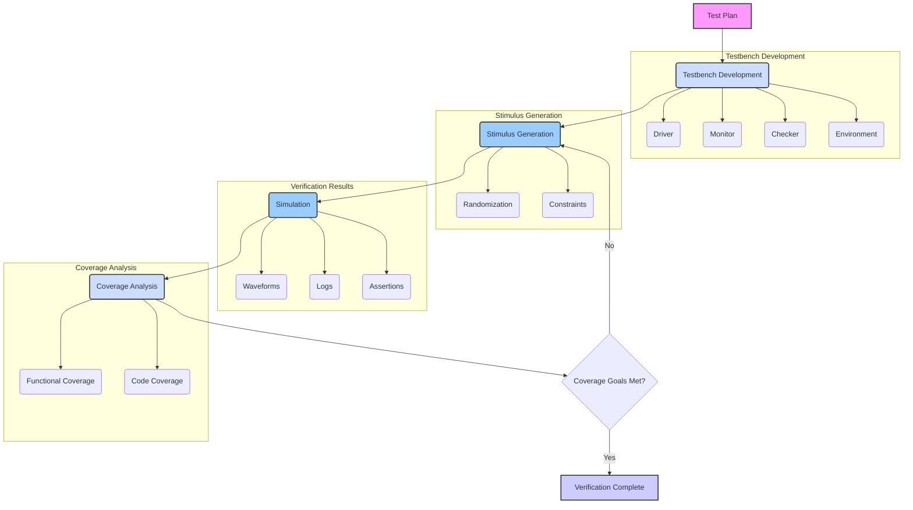
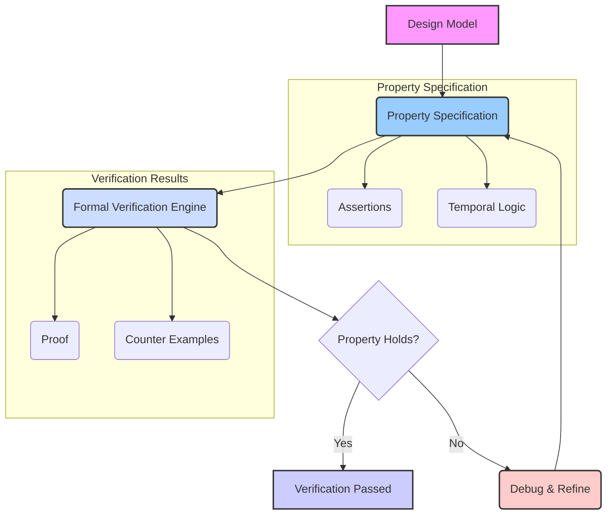
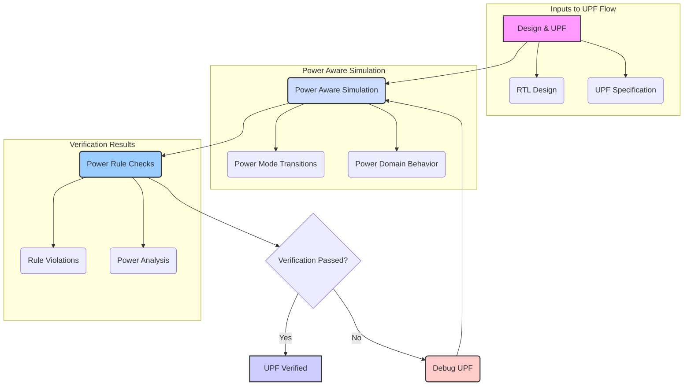

# ASIC Verification: CLP, FV, and UPF (IEEE 1801) - A Comprehensive Guide

## Table of Contents

1.  [Introduction to ASIC Verification](#introduction-to-asic-verification)
2.  [Constrained-Random Layered Verification (CLP)](#constrained-random-layered-verification-clp)
    *   [Verification Environment](#verification-environment)
        *   [Testbench Architecture](#testbench-architecture)
        *   [Verification Components](#verification-components)
    *   [Constrained Random Stimulus Generation](#constrained-random-stimulus-generation)
        *   [Randomization Techniques](#randomization-techniques)
        *   [Coverage Driven Verification](#coverage-driven-verification)
    *   [Layered Approach](#layered-approach)
        *  [Transaction Layer](#transaction-layer)
        *   [Functional Layer](#functional-layer)
        *    [Bus Layer](#bus-layer)
    *   [Assertions and Monitors](#assertions-and-monitors)
        *   [Assertions](#assertions)
        *   [Monitors](#monitors)
    * [Verification Flow Diagram](#verification-flow-diagram)
3.  [Formal Verification (FV)](#formal-verification-fv)
    *   [Introduction to Formal Verification](#introduction-to-formal-verification)
    *   [Property Specification](#property-specification)
        *   [Assertions and Properties](#assertions-and-properties)
        *   [Temporal Logic](#temporal-logic)
    *   [Model Checking](#model-checking)
         *   [State Space Exploration](#state-space-exploration)
         *   [Bounded Model Checking](#bounded-model-checking)
    *   [Equivalence Checking](#equivalence-checking)
        *   [RTL-to-Gate Equivalence](#rtl-to-gate-equivalence)
        *  [Gate-to-Gate Equivalence](#gate-to-gate-equivalence)
    *   [Formal Verification Flow](#formal-verification-flow)
4.  [Unified Power Format (UPF) - IEEE 1801 Standard](#unified-power-format-upf-ieee-1801-standard)
    *   [Introduction to UPF](#introduction-to-upf)
    *   [Power Domains](#power-domains)
        *   [Power Intent Specification](#power-intent-specification)
        *  [Power States](#power-states)
    *   [Power Switching and Control](#power-switching-and-control)
         *   [Power Gates](#power-gates)
        *  [Isolation Cells](#isolation-cells)
        *   [Level Shifters](#level-shifters)
    *   [UPF Verification](#upf-verification)
        *   [Power Aware Simulation](#power-aware-simulation)
        *   [Power Rule Checks](#power-rule-checks)
    *   [UPF Flow Diagram](#upf-flow-diagram)
5.  [Industry Practices and Tools](#industry-practices-and-tools)
    *   [Verification Tools](#verification-tools)
    *   [Formal Verification Tools](#formal-verification-tools)
    *   [Power Aware Verification Tools](#power-aware-verification-tools)
6.  [Conclusion](#conclusion)

## Introduction to ASIC Verification

ASIC (Application-Specific Integrated Circuit) verification is a critical phase in the design flow that ensures the correctness and functionality of a chip before it is manufactured. Verification aims to identify and eliminate design bugs by thoroughly testing the design against its specifications. This process typically includes functional verification, which focuses on the logic of the design, and power-aware verification which checks the design for low power functionality. Proper verification methods are used to test all the aspects of the design.

## Constrained-Random Layered Verification (CLP)

Constrained-Random Layered Verification (CLP) is a widely adopted methodology for verifying complex digital designs. It combines the power of random stimulus generation with constraints to target specific scenarios. Layered architecture helps to manage complexity and improve reusability of verification components.

### Verification Environment

The verification environment provides a framework for testing the design under verification (DUV).

#### Testbench Architecture

*   **Modular Design:** Testbenches are designed using modular and reusable components.
*   **Separation of Concerns:**  The testbench architecture should separate stimulus generation, response monitoring, and checking mechanisms.
*  **Standardization:** Testbench can be built using standard methodologies like UVM.

#### Verification Components

*   **Driver:**  Drives the inputs to the DUV based on the stimulus.
*   **Monitor:** Observes the outputs of the DUV and converts them to transactions.
*   **Checker:** Compares the actual outputs with the expected outputs based on the design specification.
*   **Sequencer:** Generates the sequence of transactions to be applied to the DUV.
*  **Environment:** Connects all the components and coordinates the operations.

### Constrained Random Stimulus Generation

Constrained-random stimulus generation is a key aspect of CLP.

#### Randomization Techniques

*   **Random Data:** Generating random data based on the specifications.
*  **Constraints:**  Random stimulus can be constrained using various constraints to target specific scenarios.
*   **Coverage Goal:** The random stimuli should be generated to achieve the required coverage goal.

#### Coverage Driven Verification

*   **Coverage Metrics:** Coverage driven verification tracks the different coverage metrics.
*   **Functional Coverage:** Measuring the coverage of the various scenarios in the design.
*  **Code Coverage:** Measuring the coverage of the code during the simulation.
*   **Coverage Analysis:** Analysis is done based on the coverage to find the gaps.

### Layered Approach

A layered approach separates different aspects of the verification process for better management.

#### Transaction Layer

*   **High Level Operations:** Defines the high-level transactions that represent operations on the interface of the DUV.
*  **Abstraction:** Provides an abstraction layer from the low level details of the interface.
*  **Reusable Components:** Can be used to create reusable verification components.

#### Functional Layer

*   **Functional Checks:** Implements functional checks based on the design specification.
*   **Checking Logic:** Contains the checking logic for the verification components.
*   **Verification Tasks:** Contains all the complex verification tasks to be performed.

#### Bus Layer

*  **Protocol Implementation:** Implements the details of the bus protocol.
*  **Low Level Details:** Handles the low level details of the bus interface.
*  **Interface Signals:** Drives and monitors the individual signals in the interface.

### Assertions and Monitors

Assertions and monitors are used to detect errors during verification.

#### Assertions

*   **Design Properties:** Assertions check if certain design properties hold true during simulation.
*   **Error Detection:** Can detect errors in the design when a certain property fails.
*   **Coverage:** Assertions can also be used for coverage.

#### Monitors

*   **Data Observation:** Monitors observe the data at the interface of the DUV.
*   **Transaction Capture:**  They capture the information related to the transactions happening at the interface.
*  **Protocol Verification:** Useful for verifying complex bus protocols.

### Verification Flow Diagram

Here is a flow diagram of the CLP verification process:

*   **Test Plan:** Initial step is to create a plan that contains the goals for the verification.
*   **Testbench Development:** Develop the verification environment including the driver, monitor and checkers.
*   **Stimulus Generation:** Generate the stimuli for the verification environment based on constraints and coverage requirements.
*   **Simulation:** Run the simulation using the generated stimuli.
*   **Coverage Analysis:** Analyze the coverage achieved from the simulation.
*  **Coverage Goals Met:** If the coverage goals are not met then the stimulus needs to be refined based on the areas where coverage is missing.

## Formal Verification (FV)

Formal verification uses mathematical techniques to prove the correctness of a design without relying on simulation.

### Introduction to Formal Verification

*   **Mathematical Proof:** Formal verification uses mathematical methods to prove that a design meets certain properties.
*   **Exhaustive Analysis:** Unlike simulation, formal verification exhaustively explores all possible scenarios.
*  **Bug Finding:**  Formal methods are useful for finding deep bugs which are hard to find using simulation.

### Property Specification

Formal verification requires the specification of design properties to be verified.

#### Assertions and Properties

*   **Design Rules:** Properties describe the design rules and specifications to be checked.
*   **Safety and Liveness:** Properties usually check for safety and liveness properties of the design.
*   **Verification Goals:** The properties capture the goals of the verification.

#### Temporal Logic

*  **Time Based Properties:** Temporal logic is used to specify properties that involve time.
*   **LTL and CTL:** Linear Temporal Logic (LTL) and Computation Tree Logic (CTL) are two popular temporal logics used for formal verification.
*  **Complex Properties:** Complex properties involving sequence of events can be specified using temporal logic.

### Model Checking

Model checking is a formal verification technique that checks if a model of the system satisfies the properties specified.

#### State Space Exploration

*  **State Exploration:** Model checking explores the complete state space of the design.
*   **State Transitions:** Checks if all the possible state transitions of the design are correct.
*  **Property Verification:** Checks if the property is satisfied for all the possible states of the design.

#### Bounded Model Checking

*  **Bounded Exploration:** In bounded model checking the state space is explored up to a certain bound.
*  **Partial State Space:** Bounded model checking only explores a part of the state space.
*   **Faster Verification:** Bounded model checking provides a faster way to verify certain properties.

### Equivalence Checking

Equivalence checking verifies if two different implementations of the same design are equivalent.

#### RTL-to-Gate Equivalence

*   **RTL and Gate Level:** Verifies that the gate level implementation of the design is equivalent to the RTL implementation.
*  **Synthesis Verification:** Useful in verifying the synthesis flow.
*   **Functionality:** Ensures that the synthesis tool did not change the functionality of the design.

#### Gate-to-Gate Equivalence

*  **Two Gate Level Implementations:** Verifies the equivalence of two different gate level implementations of the design.
*   **ECO Verification:** Useful to check if the ECO implementation is equivalent to the previous version.
*   **Physical Design Impact:** Helps in making sure that the ECO does not change the functionality.

### Formal Verification Flow

Here's a flow diagram of a typical formal verification process:

*   **Design Model:** Input is the design model to be verified.
*   **Property Specification:** Specify the properties for the design using assertions or temporal logic.
*   **Formal Verification Engine:** Run the formal verification engine to check if the properties are satisfied.
*   **Property Holds:** If the property does not hold then debug and refine the properties.

## Unified Power Format (UPF) - IEEE 1801 Standard

The Unified Power Format (UPF) is an industry standard (IEEE 1801) for specifying power intent of a design. It provides a language to describe power domains, power states, and power control mechanisms.

### Introduction to UPF

*   **Power Intent:** UPF is used to capture the power intent of the design.
*   **Low Power Verification:** UPF is needed for power aware verification of the design.
*   **Power Design:** All low power design techniques such as power gating, multi voltage operation etc can be specified using UPF.

### Power Domains

Power domains are regions of the design that can be controlled independently for power management.

#### Power Intent Specification

*   **Power Domains Definition:** Defining different power domains for the design.
*   **Voltage Level:** Specifying the voltage level for each of the power domains.
*   **Power Modes:** Defining the different power modes for the different power domains.

#### Power States

*   **Operational States:** Power states define the different operational states of a power domain.
*   **Active, Sleep and Off States:** Various power states such as active, sleep, and off can be defined for each power domain.
*  **Transition Rules:** Rules specifying how to transition between different states can be defined.

### Power Switching and Control

UPF is also used to specify various power switching and control mechanisms.

#### Power Gates

*   **Power Switching:** Power gates are used to switch the power supply on and off for specific power domains.
*   **Leakage Control:** Used to reduce the leakage current by cutting off the power supply.
*  **Power Saving:** Saves power by turning off the unused power domains.

#### Isolation Cells

*   **Signal Integrity:**  Isolation cells are used at the boundary of different power domains to prevent short circuits.
*   **Data Integrity:** Ensures the signal integrity between different power domains.
*  **Power Domain Interfaces:** Used at the interface between power domains.

#### Level Shifters

*   **Voltage Conversion:** Level shifters are used to convert voltages between different power domains.
*   **Signal Compatibility:** Ensures the signal compatibility between the different power domains.
*   **Interface Circuits:** Used at the interface of multi voltage power domains.

### UPF Verification

UPF verification checks the power intent of a design and ensures correct functionality of the design with power management features.

#### Power Aware Simulation

*   **Power Behavior:** Simulating the design with all the power intent specified.
*  **Power Modes:** Verifying the correct operation of the different power modes.
*  **Dynamic Verification:** Verifying the dynamic behavior of the circuit with power management.

#### Power Rule Checks

*   **Power Rules:** Checks for proper implementation of power rules.
*   **UPF Verification:** Checks for all UPF violations and errors.
*  **Completeness Checks:** Checks for proper implementation of all the power management techniques.

### UPF Flow Diagram

Here is a flow diagram outlining the UPF verification process:

*   **Design & UPF:** Inputs are the design and the UPF file which describes the power intent of the design.
*   **Power Aware Simulation:** Simulating the design based on the power intent described in the UPF.
*   **Power Rule Checks:** Verification of the various power rules that have to be followed.
*   **Verification Passed:** If verification passes then the UPF is verified.

## Industry Practices and Tools

### Verification Tools

*   **Questa (Siemens EDA):** A powerful simulation tool for CLP based verification.
*   **VCS (Synopsys):** A widely used simulator for functional verification.
*   **Xcelium (Cadence):** A high-performance simulation tool for complex verification.

### Formal Verification Tools

*   **JasperGold (Cadence):** A leading formal verification platform.
*   **Questa Formal (Siemens EDA):** A tool for formal verification based on assertions.
*   **VC Formal (Synopsys):** Synopsys tool for formal verification of design.

### Power Aware Verification Tools

*   **Voltus (Cadence):** A tool for power analysis and power aware verification.
*   **PowerArtist (Synopsys):** A tool for power analysis and UPF based power verification.
*  **Questa Power Aware (Siemens EDA):** Used for power aware simulation.

## Conclusion

ASIC verification is a complex process that requires the use of several methods and tools. This comprehensive overview of Constrained-Random Layered Verification (CLP), Formal Verification (FV), and the Unified Power Format (UPF) provides a solid foundation for understanding these crucial aspects of ASIC design. The industry standards and the tools used in the verification domain are also detailed in this document. The verification is a critical part of ASIC design and is essential for creating robust and reliable designs.