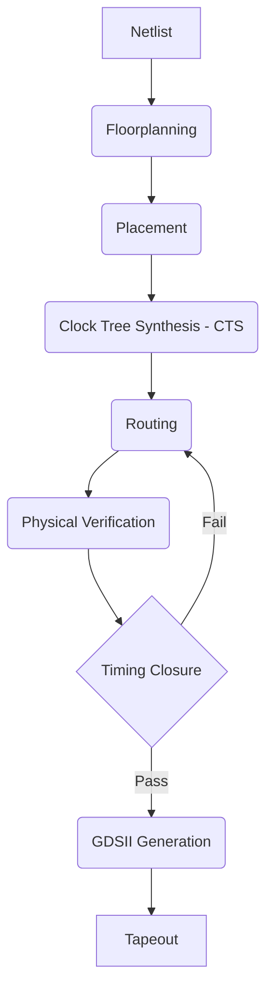
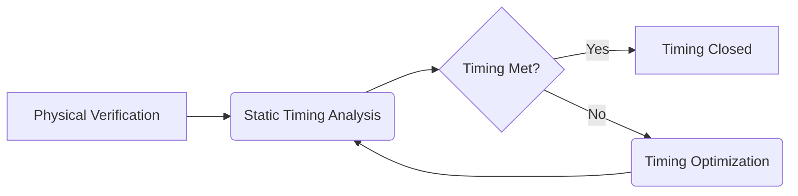

# Physical Design in ASIC: A Comprehensive Guide

## Table of Contents

1.  [Introduction to Physical Design](#introduction-to-physical-design)
2.  [Physical Design Flow](#physical-design-flow)
    *   [Floorplanning](#floorplanning)
        *   [Chip Size and Aspect Ratio](#chip-size-and-aspect-ratio)
        *   [Block Placement](#block-placement)
        *   [Pin Placement and IO Planning](#pin-placement-and-io-planning)
        *   [Power and Ground Planning](#power-and-ground-planning)
        *   [Floorplanning Techniques](#floorplanning-techniques)
    *   [Placement](#placement)
        *   [Standard Cell Placement](#standard-cell-placement)
        *   [Placement Algorithms](#placement-algorithms)
        *   [Placement Constraints and Objectives](#placement-constraints-and-objectives)
    *    [Clock Tree Synthesis (CTS)](#clock-tree-synthesis-cts)
        *   [Clock Tree Design Goals](#clock-tree-design-goals)
        *  [Clock Tree Architectures](#clock-tree-architectures)
        *   [Clock Skew and Jitter](#clock-skew-and-jitter)
        *   [CTS Implementation](#cts-implementation)
    *   [Routing](#routing)
        *  [Global Routing](#global-routing)
        *  [Detailed Routing](#detailed-routing)
        *   [Routing Layers and Tracks](#routing-layers-and-tracks)
        *   [Routing Algorithms and Techniques](#routing-algorithms-and-techniques)
        *   [Signal Integrity Considerations](#signal-integrity-considerations)
    *   [Physical Verification](#physical-verification)
        *   [Design Rule Checking (DRC)](#design-rule-checking-drc)
        *   [Layout Versus Schematic (LVS)](#layout-versus-schematic-lvs)
        *   [Electrical Rule Checking (ERC)](#electrical-rule-checking-erc)
        *    [Antenna Check](#antenna-check)
        *   [Physical Verification Tools](#physical-verification-tools)
    *   [Timing Closure](#timing-closure)
        *   [Static Timing Analysis (STA)](#static-timing-analysis-sta)
        *   [Timing Optimization Techniques](#timing-optimization-techniques)
        *   [Engineering Change Orders (ECOs)](#engineering-change-orders-ecos)
        *   [Iterative Nature of Timing Closure](#iterative-nature-of-timing-closure)
    *   [GDSII Generation](#gdsii-generation)
3.  [Industry Practices and Tools](#industry-practices-and-tools)
    *  [Floorplanning Tools](#floorplanning-tools)
    *  [Placement and Routing Tools](#placement-and-routing-tools)
    *  [Physical Verification Tools](#physical-verification-tools)
4.  [Conclusion](#conclusion)

## Introduction to Physical Design

Physical Design (PD) is the crucial stage in the ASIC design flow where the abstract, logical representation of the circuit (gate-level netlist) is transformed into a concrete physical layout. This layout specifies the precise placement of transistors, standard cells, and the routing of interconnections on the silicon die. The outcome of physical design directly affects the chip's performance, power consumption, manufacturing cost, and reliability. In essence, physical design bridges the gap between logic design and the actual fabrication of the chip. Physical design follows a structured process which has multiple stages and iterations.

## Physical Design Flow

The physical design flow involves several sequential steps, each with specific objectives and constraints. Here's a detailed breakdown of these stages:

### Floorplanning

Floorplanning is the initial step in physical design, where the overall chip layout is planned. It involves making critical decisions that impact the entire design process.

#### Chip Size and Aspect Ratio

*   **Die Size Estimation:**  Based on the circuit's complexity, the total area required to accommodate all the logic and routing is determined. This is crucial for cost estimation.
*   **Aspect Ratio:** This defines the shape of the die (e.g., square, rectangular) and affects the distribution of power, signal routing, and overall performance.

#### Block Placement

*   **Macro Placement:** Large functional blocks such as memory blocks, analog circuits, and intellectual property (IP) cores are strategically placed on the chip.
*   **Placement Considerations:** Placement decisions take into account factors like communication between blocks, power distribution, and thermal considerations.
*  **Hard and Soft Macros:** Hard macros have fixed layout and dimensions, while soft macros allow some flexibility in the layout and the dimensions.

#### Pin Placement and IO Planning

*   **I/O Pad Placement:** Input/output (I/O) pads are placed along the chip's periphery for external connections.
*   **Signal and Power Pins:** Placement of I/O pins is crucial for signal integrity, power distribution, and ease of bonding to the package.
*  **Core to IO Ring Communication:** The communication between the functional blocks in the core to the periphery has to be planned so that it takes optimal path.

#### Power and Ground Planning

*   **Power Grid Design:** A robust power distribution network (PDN) is designed to deliver stable power to all parts of the chip with minimal voltage drop and noise. The grid has to have low resistance and low inductance.
*   **Power Straps and Rings:** Power and ground lines (straps) are routed to ensure low-resistance paths. Power rings are usually placed along the periphery of the chip.
*  **Decoupling Capacitors:** Decoupling capacitors are placed near the blocks to locally filter noise and compensate for fluctuations in power supply.

#### Floorplanning Techniques
*   **Manual Floorplanning:** Designers manually create the floorplan based on their experience and knowledge of the design.
*  **Automatic Floorplanning:** Automated tools use algorithms to optimize block placement based on predefined objectives.
*  **Hybrid Approach:** A combination of manual and automatic methods can be used to achieve the best results.

### Placement

Placement is the stage where the standard cells from the synthesized netlist are placed within the floorplan area. It's a crucial step that greatly affects the chip's performance, power, and area.

#### Standard Cell Placement

*   **Cell Row Placement:** Standard cells are typically placed in rows, with alternating power and ground lines running in between them.
*   **Placement Density:**  The density of the placement has to be such that it can accommodate all cells and also leave adequate space for routing.
*   **Timing and Congestion Considerations:** Placement is optimized to minimize wire lengths, meet timing requirements, and avoid routing congestion.

#### Placement Algorithms

*   **Analytical Placement:** Mathematical algorithms are used to find the optimal placement by formulating the problem with a cost function.
*   **Simulated Annealing:**  A probabilistic algorithm is used to iteratively adjust cell positions to find a low-cost solution, which considers timing and routing.
*   **Force-Directed Placement:** Cells are treated as interacting particles, and their positions are optimized based on attracting or repelling forces.
*   **Partitioning:** The design is broken down into smaller sections that are placed individually and then the placement is further optimized.

#### Placement Constraints and Objectives

*   **Timing Constraints:** Cells are placed to minimize delays along critical timing paths.
*   **Area Constraints:** The total area occupied by the cells must fit within the allocated space.
*   **Power Constraints:** Cells are placed to minimize power consumption.
*  **Wire length:** The wire length should be minimized to reduce delay, power and area.
*   **Congestion Avoidance:** Placement aims to avoid congestion by creating space between logic blocks that require a large number of routing connections.

### Clock Tree Synthesis (CTS)

Clock Tree Synthesis (CTS) is the process of creating a balanced clock distribution network that delivers the clock signal to all clocked elements on the chip with minimal skew and jitter.

#### Clock Tree Design Goals

*   **Low Clock Skew:** Minimize the difference in arrival times of the clock signal at different flip-flops.
*   **Low Clock Jitter:** Reduce the variation in clock signal period due to noise or other fluctuations.
*   **Low Power Consumption:** Minimize power consumed by the clock distribution network.
*   **Robustness:** Ensure the clock signal is reliable under variations in process, voltage, and temperature.

#### Clock Tree Architectures

*   **H-Tree:** A balanced tree with a hierarchical structure, commonly used for its symmetry.
*   **Clock Mesh:** A network of interconnected clock wires providing low impedance paths.
*   **Hybrid:** Combining the characteristics of H-tree and clock mesh.
*  **Spine and Branch:** The clock signal is distributed using spine and branches emanating from it.

#### Clock Skew and Jitter

*   **Clock Skew:**  The difference in clock arrival time between two flip-flops. It can cause setup or hold time violations.
*   **Clock Jitter:** The cycle-to-cycle variation in the clock signal period. It can cause errors in synchronous circuits.

#### CTS Implementation

*   **Clock Tree Buffering:** Buffers or inverters are inserted along the clock tree to equalize delays and increase drive strength.
*   **Clock Balancing:**  The clock tree is balanced by adjusting the delays to the clock pins of sequential elements.
*   **Clock Shielding:** Shield wires are used to minimize the coupling capacitance between the clock lines and other signal lines.

### Routing

Routing is the process of connecting the placed standard cells and other blocks by creating metal interconnections.

#### Global Routing

*   **Routing Region Partitioning:** The routing area is divided into smaller regions or tiles.
*   **Route Planning:**  Global routes are planned based on the connection requirements between various regions.
*   **Congestion Minimization:** Global routing aims to minimize the congestion in various regions of the design.

#### Detailed Routing

*   **Track Assignment:** Specific metal layers and tracks are assigned to individual interconnections.
*   **Via Insertion:** Vias are added to connect different metal layers.
*   **Design Rule Adherence:**  Detailed routing must adhere to the design rules of the target technology.

#### Routing Layers and Tracks

*   **Metal Layers:** Multiple metal layers are used for routing, each with different properties such as resistance and capacitance.
*   **Track Pitch:** The spacing between adjacent routing tracks.
*   **Routing Direction:** Typically, horizontal and vertical routing is performed on different metal layers to minimize interference.

#### Routing Algorithms and Techniques

*   **Maze Routing:**  A path-finding algorithm that finds the shortest path between two points.
*   **Line Probe Algorithm:** Similar to maze routing, but it uses line probes to find the paths.
*   **Channel Routing:** Used to route interconnections within a routing channel.
*  **Area Routing:** Used to route interconnections in a two-dimensional region

#### Signal Integrity Considerations

*   **Crosstalk:** Minimize crosstalk (interference between adjacent signal lines) by spacing and shielding.
*   **IR Drop:** Ensure power and ground lines have minimal voltage drop due to resistance.
*    **Electromigration:** Limit the current densities in metal lines to avoid electromigration (metal atom movement due to high current density), which can lead to failures.

### Physical Verification

Physical Verification is a set of checks to ensure that the designed layout meets the manufacturing and functional requirements before tape out.

#### Design Rule Checking (DRC)

*   **Geometric Rules:**  Verify that the layout adheres to the geometric design rules of the target technology (minimum spacing, width, overlaps, etc.)
*   **Manufacturing Compliance:** Ensures the chip can be manufactured without defects.
*   **Rule Deck:** The specific design rules are given in a rule deck provided by the foundry.

#### Layout Versus Schematic (LVS)

*   **Connectivity Check:**  Verifies that the physical layout matches the connectivity defined by the gate-level netlist.
*   **Functional Equivalence:** Ensures that the implemented circuit matches the intended functionality.
*   **Device Check:** Checks that the devices in layout match the number of devices in the netlist

#### Electrical Rule Checking (ERC)

*   **Electrical Issues:** Checks for electrical issues in the layout, such as short circuits, open circuits, and antenna violations.
*   **Antenna Rules:** Checks for antenna violations, which can cause damage to transistors during the manufacturing process.
*  **Reliability:** Checks for reliability of the layout to ensure long term functionality of the circuit.

#### Antenna Check
*  **Charge Buildup:** Checks for charge build up due to various manufacturing process steps.
*  **Gate Damage:** A charge build up can damage the thin gate oxide.
*   **Antenna Diode Insertion:**  A diode can be inserted to dissipate the charge and avoid damage to transistors.

#### Physical Verification Tools
*   **Calibre (Siemens EDA):** An industry-standard tool for DRC, LVS, and ERC verification.
*   **Assura (Cadence):** Another popular physical verification tool.
*   **PVS (Synopsys):** Synopsys' tool for physical verification.

### Timing Closure

Timing closure is the iterative process of analyzing timing violations, and modifying the design or constraints to meet the timing specifications.

#### Static Timing Analysis (STA)

*   **Timing Analysis:**  Checks the timing performance of the design by analyzing all timing paths without performing simulation.
*   **Setup and Hold Checks:** Verifies that signals arrive at flip-flops within the required setup and hold time windows.
*   **Clock Skew Analysis:** Checks for excessive clock skew.
*   **Path Analysis:** Analyzes all the critical timing paths.

#### Timing Optimization Techniques

*   **Logic Optimization:**  Resizing gates and restructuring the logic for timing improvement.
*   **Placement Optimization:** Adjusting cell placement to reduce wire delays.
*   **Routing Optimization:** Modifying the routing to improve the timing.
*   **Clock Tree Optimization:** Balancing the clock tree for minimal skew.

#### Engineering Change Orders (ECOs)

*   **Design Changes:**  Small changes in layout to fix timing or other issues.
*   **Incremental Changes:** ECOs avoid redoing the entire design process.

#### Iterative Nature of Timing Closure
*   **Repeated Iterations:** The timing closure process is iterative, and it requires multiple iterations to achieve convergence.
*   **Collaboration:** Collaboration between logic designers and physical designers may be required to resolve complex timing issues.

### GDSII Generation

GDSII (Graphic Design System II) is the standard format used to represent the final layout of the integrated circuit.

*   **Layout Database:** All physical design data is converted into GDSII format.
*   **Tapeout:** The GDSII file is sent to the foundry for mask generation.
*    **Design Database:** The design database in the physical design tools is converted to the GDSII format.

## Industry Practices and Tools

### Floorplanning Tools

*   **IC Compiler II (Synopsys):**  A comprehensive physical design tool that includes floorplanning capabilities.
*   **Innovus Implementation System (Cadence):**  Another industry-leading tool for floorplanning, placement, and routing.
*   **Aprisa (Siemens EDA):** A tool by Siemens for physical design.

### Placement and Routing Tools

*   **IC Compiler II (Synopsys):** Widely used for both placement and routing, offering a range of optimization techniques.
*   **Innovus Implementation System (Cadence):**  Provides advanced placement and routing algorithms for complex designs.
*   **Olympus-SoC (Siemens EDA):** Siemens tool for placement and routing in physical design.

### Physical Verification Tools

*   **Calibre (Siemens EDA):** An industry-standard tool for DRC, LVS, and ERC verification.
*   **Assura (Cadence):**  A popular physical verification tool integrated with Cadence layout tools.
*   **PVS (Synopsys):** Synopsys' tool for physical verification, commonly used in conjunction with their placement and routing tools.

## Conclusion

Physical design is a complex and iterative process that involves several stages, each requiring careful consideration and optimization. From initial floorplanning to final GDSII generation, each step has a significant impact on the performance, power, cost, and manufacturability of the ASIC. Understanding the intricacies of each of these steps is critical for designing successful ASICs. The described physical design flow is used throughout the industry for design of various ASICs. This description will give a clear understanding of the physical design flow.

