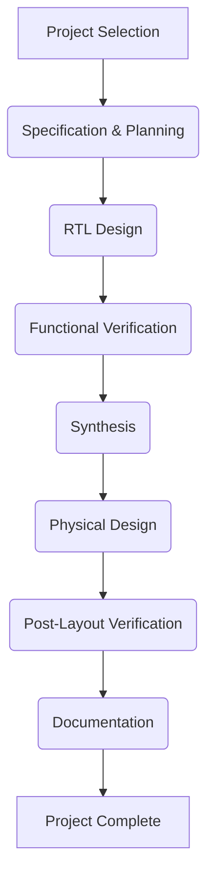

# ASIC Design Projects: A Practical Guide

## Table of Contents

1.  [Introduction to ASIC Design Projects](#introduction-to-asic-design-projects)
2.  [Project Ideas and Scope](#project-ideas-and-scope)
    *   [Digital Logic Projects](#digital-logic-projects)
        *   [Arithmetic Logic Unit (ALU) Design](#arithmetic-logic-unit-alu-design)
        *   [RISC-V Processor Core](#risc-v-processor-core)
        *   [Memory Controller](#memory-controller)
        *   [Digital Signal Processing (DSP) Blocks](#digital-signal-processing-dsp-blocks)
    *   [Mixed-Signal Projects](#mixed-signal-projects)
        *   [Analog-to-Digital Converter (ADC)](#analog-to-digital-converter-adc)
        *   [Digital-to-Analog Converter (DAC)](#digital-to-analog-converter-dac)
        *   [Phase-Locked Loop (PLL)](#phase-locked-loop-pll)
    *   [Interconnect and Network-on-Chip (NoC) Projects](#interconnect-and-network-on-chip-noc-projects)
        *  [NoC Router Design](#noc-router-design)
        *  [Interconnect IP Design](#interconnect-ip-design)
3.  [Project Planning and Methodology](#project-planning-and-methodology)
    *   [Define Project Goals and Specifications](#define-project-goals-and-specifications)
    *   [RTL Design and Verification](#rtl-design-and-verification)
    *   [Logic Synthesis](#logic-synthesis)
    *   [Physical Design Implementation](#physical-design-implementation)
    *   [Verification and Validation](#verification-and-validation)
    *   [Documentation](#documentation)
4.  [Tools and Resources for ASIC Design Projects](#tools-and-resources-for-asic-design-projects)
    *   [EDA Tools](#eda-tools)
        *   [Simulation Tools](#simulation-tools)
        *   [Synthesis Tools](#synthesis-tools)
        *   [Physical Design Tools](#physical-design-tools)
        *  [Verification Tools](#verification-tools)
    *   [Hardware Description Languages (HDLs)](#hardware-description-languages-hdls)
    *   [Open-Source IP Cores](#open-source-ip-cores)
    *   [Online Courses and Tutorials](#online-courses-and-tutorials)
    *   [FPGA Prototyping](#fpga-prototyping)
5.  [Step-by-Step Guide for ASIC Design Projects](#step-by-step-guide-for-asic-design-projects)
    *   [Project Selection](#project-selection)
    *   [Specification and Planning](#specification-and-planning)
    *   [RTL Design and Coding](#rtl-design-and-coding)
    *   [Functional Verification](#functional-verification)
    *   [Synthesis and Optimization](#synthesis-and-optimization)
    *  [Physical Design](#physical-design)
    *   [Post Layout Verification](#post-layout-verification)
    *   [Documentation](#documentation)
6. [Project Flow Diagram](#project-flow-diagram)
7.  [Challenges and Considerations](#challenges-and-considerations)
    *   [Design Complexity](#design-complexity)
    *   [Tool Learning Curve](#tool-learning-curve)
    *   [Verification Challenges](#verification-challenges)
    *   [Physical Design Constraints](#physical-design-constraints)
    *   [Access to Fabrication](#access-to-fabrication)
8.  [Conclusion](#conclusion)

## Introduction to ASIC Design Projects

ASIC (Application-Specific Integrated Circuit) design projects provide an excellent way for aspiring chip designers to gain hands-on experience and apply theoretical knowledge. These projects can range from simple logic circuits to complex processors and mixed-signal designs. Engaging in such projects allows designers to understand the end-to-end ASIC design flow, from concept to implementation. This practical experience is invaluable for anyone pursuing a career in the semiconductor industry. These projects can be done as part of a university course or as a personal hobby project. The goal of these projects is to learn all the different aspects of the ASIC design process.

## Project Ideas and Scope

ASIC design projects can be categorized into different domains, each offering unique challenges and learning opportunities.

### Digital Logic Projects

Digital logic projects involve the design of circuits that perform Boolean operations. These projects are fundamental to understanding the basics of digital design and can form the building blocks for more complex designs.

#### Arithmetic Logic Unit (ALU) Design

*   **Functionality:** Design an ALU that can perform basic arithmetic and logical operations such as addition, subtraction, AND, OR, and XOR.
*   **Complexity:** Can be scaled from simple 4-bit designs to more complex 32-bit or 64-bit designs, including floating-point operations.
*   **Learning:** Understanding of arithmetic operations, logic design, and control unit design.

#### RISC-V Processor Core

*   **Functionality:** Implement a simplified RISC-V instruction set architecture (ISA).
*   **Complexity:**  Can range from a basic single-cycle processor to a pipelined processor with cache memory.
*   **Learning:**  In-depth knowledge of processor architecture, instruction decoding, and pipelining.

#### Memory Controller

*   **Functionality:** Design a controller to manage data access between memory and other parts of the system.
*   **Complexity:** Can include features such as address mapping, refresh cycles, and error correction.
*   **Learning:** Understanding of memory architecture, timing constraints, and data management.

#### Digital Signal Processing (DSP) Blocks

*   **Functionality:** Design basic DSP algorithms such as FIR or IIR filters.
*   **Complexity:** Can range from simple filters to more complex FFT algorithms or advanced signal processing functions.
*   **Learning:** Knowledge of DSP concepts, filter design, and implementation.

### Mixed-Signal Projects

Mixed-signal projects combine both analog and digital circuit design elements. These projects involve interfaces between the analog world and digital world.

#### Analog-to-Digital Converter (ADC)

*   **Functionality:** Design an ADC that can convert an analog input voltage to a digital value.
*   **Complexity:** Different ADC architectures can be implemented such as SAR, flash, or sigma-delta.
*   **Learning:** Knowledge of analog circuit design, quantization, and sampling theory.

#### Digital-to-Analog Converter (DAC)

*   **Functionality:** Design a DAC that can convert a digital value to an analog voltage.
*   **Complexity:**  Different DAC architectures can be implemented such as R-2R ladder or current steering.
*   **Learning:** Understanding of analog design, and output stage considerations.

#### Phase-Locked Loop (PLL)

*   **Functionality:** Design a PLL for clock generation and frequency synthesis.
*   **Complexity:**  Can include features such as charge pumps, voltage-controlled oscillators (VCO), and loop filters.
*   **Learning:** Knowledge of analog design, feedback control, and frequency synthesis.

### Interconnect and Network-on-Chip (NoC) Projects

Interconnect projects focus on the communication architecture within the chip.

#### NoC Router Design

*  **Functionality:** Design a router for Network-on-Chip architecture for on chip communication.
*  **Complexity:** Different architectures for the router can be implemented including buffer design and arbitration mechanisms.
*   **Learning:** Understanding of on chip communication and low latency network design.

#### Interconnect IP Design
*   **Functionality:** Design standard interconnect protocols such as AXI or APB bus interfaces.
*  **Complexity:** Design and verification of complex bus interfaces including arbitration schemes and low power design.
*   **Learning:** Understanding of bus protocols, timing and signal integrity for on chip communication.

## Project Planning and Methodology

Effective project planning is crucial for a successful ASIC design project. Here are the key steps:

### Define Project Goals and Specifications

*   **Clear Objectives:** Clearly define the goals and objectives of the project.
*   **Detailed Specifications:** Document the required functionality, performance, and interface requirements.
*  **Constraints:** Specify the power, area and performance constraints of the project.

### RTL Design and Verification

*   **Hardware Description Language (HDL):** Use Verilog or VHDL to describe the design at the Register Transfer Level (RTL).
*   **Testbenches:** Create testbenches to verify the design's functionality.
*   **Simulation:** Simulate the RTL code to verify its correctness before moving to logic synthesis.

### Logic Synthesis

*   **Synthesis Tools:** Use synthesis tools to convert the RTL code to a gate-level netlist.
*   **Constraints:** Specify timing, area, and power constraints for the synthesis process.
*   **Optimization:** Optimize the synthesized netlist to meet the required constraints.

### Physical Design Implementation

*   **Floorplanning:** Plan the layout of the chip, including placement of blocks and I/O pins.
*   **Placement:** Place the standard cells onto the chip layout.
*   **Routing:** Connect the cells using metal interconnects.

### Verification and Validation

*   **Static Timing Analysis:** Verify the timing performance of the design.
*   **Physical Verification:**  Check the layout for design rule violations and electrical issues.
*   **Functional Testing:** Verify the fabricated chip for correct functionality.

### Documentation

*   **Design Documentation:**  Document all aspects of the design, including specifications, RTL code, testbenches, and implementation details.
*   **User Manual:** Create a user manual for the implemented design.
*   **Reports:** Create progress and final project reports.

## Tools and Resources for ASIC Design Projects

Access to the right tools and resources is vital for completing ASIC design projects.

### EDA Tools

*   **Simulation Tools:**
    *   **Questa (Siemens EDA):** Powerful simulation tool for Verilog/VHDL.
    *   **VCS (Synopsys):** Leading simulator for complex designs.
    *   **Xcelium (Cadence):** High-performance simulation tool.
    *  **Modelsim (Siemens EDA):** Industry standard simulation tool.
*   **Synthesis Tools:**
    *   **Design Compiler (Synopsys):** Widely used for RTL synthesis.
    *   **Genus Synthesis Solution (Cadence):** Advanced synthesis tool for high-performance designs.
    *    **Precision RTL Synthesis (Siemens EDA):** Tool for synthesis of the design.
*   **Physical Design Tools:**
    *   **IC Compiler II (Synopsys):** Comprehensive physical design tool.
    *   **Innovus Implementation System (Cadence):** Leading tool for placement and routing.
    *   **Aprisa (Siemens EDA):** Physical design tool for layout implementation.
*   **Verification Tools**
    *   **Calibre (Siemens EDA):** Industry standard for physical verification.
    *   **Assura (Cadence):** Tool for physical verification of the layout.
    *   **PVS (Synopsys):** Physical verification tool.

### Hardware Description Languages (HDLs)

*   **Verilog:** Widely used for digital logic design.
*   **VHDL:** Another popular HDL.
*   **SystemVerilog:** An extension of Verilog for verification and complex design.

### Open-Source IP Cores

*   **OpenCores:** A community for open-source hardware IP cores.
*   **RISC-V Cores:** Various open-source RISC-V processor implementations are available.
*   **Free and Cost-Effective:** Reduces design time and complexity.

### Online Courses and Tutorials

*   **Coursera, edX, Udemy:** Offer courses on digital design and ASIC design.
*   **YouTube Channels:** Many channels provide tutorials on EDA tools and design techniques.
*   **University Websites:** Many universities offer free online access to their course material.

### FPGA Prototyping

*   **FPGA Boards:**  Use FPGA boards to prototype the design before ASIC implementation.
*   **Verification:**  Verify the design on the FPGA and then proceed with ASIC implementation.
*   **Hardware Testing:**  Ability to test and debug the design on real hardware before going for ASIC implementation.

## Step-by-Step Guide for ASIC Design Projects

Here’s a step-by-step guide for undertaking an ASIC design project:

### Project Selection

*   **Choose a Project:** Select a project that matches interest and skill level.
*   **Feasibility:**  Ensure the project is feasible within the given time and resource constraints.
*  **Scope Definition:** Define the scope of the project so that it does not become too complicated.

### Specification and Planning

*   **Detailed Specification:**  Create a detailed design specification including functionality, performance, and interface requirements.
*   **Project Plan:** Plan the project tasks and timeline.
*   **Resource Allocation:** Allocate resources and EDA tool access.

### RTL Design and Coding

*   **HDL Coding:** Write the RTL code in Verilog or VHDL based on the design specification.
*   **Modular Design:** Break the design into smaller, manageable modules.
*   **Coding Style:** Follow good coding practices.

### Functional Verification

*   **Testbench Creation:** Create testbenches to verify the RTL code.
*   **Simulation:** Simulate and debug the RTL code.
*   **Coverage:** Ensure good code coverage to thoroughly test the design.

### Synthesis and Optimization

*   **Logic Synthesis:**  Synthesize the RTL code using synthesis tools.
*   **Constraints:** Provide proper timing, area, and power constraints.
*  **Optimization:** Optimize the synthesized netlist based on the constraints.

### Physical Design

*   **Floorplanning:** Plan the layout of the chip, including placement of blocks and I/O pins.
*   **Placement:** Place the standard cells onto the chip layout.
*   **Routing:** Connect the cells using metal interconnects.

### Post Layout Verification

*   **Static Timing Analysis (STA):** Perform STA to ensure that the timing requirements are met.
*   **Physical Verification (DRC/LVS/ERC):** Perform physical verification on the layout.
*    **Sign-off Verification:** Perform all necessary checks to ensure the layout is correct and is ready for tapeout.

### Documentation

*   **Project Reports:** Create a final report documenting the complete design process.
*   **Design Documentation:** Document the design details including the specifications, architecture and the implementation details.
*    **User Guide:** Create a user manual of the designed chip.

## Project Flow Diagram

Here’s a high-level flow diagram of the ASIC design project steps:

## Challenges and Considerations

Undertaking ASIC design projects comes with its own set of challenges and considerations.

### Design Complexity

*   **Scalability:** Designing complex circuits can be challenging, requiring a good understanding of design principles.
*   **Abstraction:** Design requires a move from low-level transistor details to higher level abstract design methodology.
*   **Modularity:** Breaking down the design into smaller modules can help in managing complexity.

### Tool Learning Curve

*   **EDA Tools:** Learning to use complex EDA tools can be time-consuming.
*   **Tool Expertise:** Proper training and online resources can be used for effective use of the tools.
*   **Practice:** Practice is required to gain proficiency in the usage of the tools.

### Verification Challenges

*   **Testbench Development:** Writing good testbenches to thoroughly test the design is important and can be challenging.
*   **Coverage Metrics:** Ensure good code coverage and functional coverage.
*   **Debugging:** Debugging can be a time consuming process if proper methodology is not followed.

### Physical Design Constraints

*   **Design Rules:**  Adhering to design rules for physical design can be tedious.
*   **Timing and Area:** Meeting timing and area constraints require iterations.
*   **Congestion:** Managing routing congestion is important for good physical design.

### Access to Fabrication

*   **Cost:** Access to fabrication can be very expensive for hobby projects.
*   **MPW (Multi-Project Wafers):** Multi-project wafer runs are a more economical way for fabrication.
*   **Simulation and Emulation:** Before fabrication simulation and emulation of the design is essential.

## Conclusion

ASIC design projects are valuable for gaining practical experience and for understanding all the different aspects of the design process. By following a systematic approach and utilizing the appropriate tools and resources, students and enthusiasts can successfully complete various ASIC design projects. The practical experience from these projects will be extremely useful for an aspiring ASIC designer. The details in this document are a useful guide for users who want to embark on ASIC design projects.
