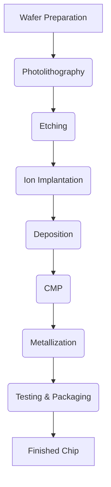

# The Science of Devices in Modern Chips: Transistors and Their Physics

## Table of Contents

1.  [Introduction to Semiconductor Devices](#introduction-to-semiconductor-devices)
2.  [Fundamentals of Semiconductor Physics](#fundamentals-of-semiconductor-physics)
    *   [Energy Bands](#energy-bands)
    *   [Intrinsic and Extrinsic Semiconductors](#intrinsic-and-extrinsic-semiconductors)
        *   [Intrinsic Semiconductors](#intrinsic-semiconductors)
        *   [Extrinsic Semiconductors](#extrinsic-semiconductors)
        *   [N-type Semiconductors](#n-type-semiconductors)
        *   [P-type Semiconductors](#p-type-semiconductors)
    *   [Carrier Transport](#carrier-transport)
        *   [Drift Current](#drift-current)
        *   [Diffusion Current](#diffusion-current)
    *   [The p-n Junction](#the-p-n-junction)
        *   [Depletion Region](#depletion-region)
        *   [Forward and Reverse Bias](#forward-and-reverse-bias)
3.  [Metal-Oxide-Semiconductor Field-Effect Transistors (MOSFETs)](#metal-oxide-semiconductor-field-effect-transistors-mosfets)
    *   [Structure of MOSFETs](#structure-of-mosfets)
        *   [NMOS Transistor](#nmos-transistor)
        *   [PMOS Transistor](#pmos-transistor)
    *   [Operation of MOSFETs](#operation-of-mosfets)
        *   [Threshold Voltage (Vt)](#threshold-voltage-vt)
        *   [Regions of Operation](#regions-of-operation)
            *   [Cut-off Region](#cut-off-region)
            *   [Linear (Triode) Region](#linear-triode-region)
            *   [Saturation Region](#saturation-region)
    *   [MOSFET Scaling and Challenges](#mosfet-scaling-and-challenges)
        *   [Short Channel Effects](#short-channel-effects)
        *   [Leakage Currents](#leakage-currents)
        *   [Velocity Saturation](#velocity-saturation)
4.  [Advanced Transistor Structures](#advanced-transistor-structures)
    *   [FinFETs](#finfets)
        *   [Structure and Operation](#structure-and-operation)
        *   [Advantages of FinFETs](#advantages-of-finfets)
    *   [Gate-All-Around (GAA) FETs](#gate-all-around-gaa-fets)
        *   [Structure and Operation](#structure-and-operation-gaa)
        *   [Advantages of GAA FETs](#advantages-of-gaa-fets)
    *   [Emerging Transistor Technologies](#emerging-transistor-technologies)
        *   [Tunnel FETs (TFETs)](#tunnel-fets-tfets)
        *   [Negative Capacitance FETs (NC-FETs)](#negative-capacitance-fets-nc-fets)
5.  [Impact on ASIC Design](#impact-on-asic-design)
    *   [Performance and Power Consumption](#performance-and-power-consumption)
    *   [Design Rules and Scaling](#design-rules-and-scaling)
    *   [Reliability Considerations](#reliability-considerations)
6.  [Device Fabrication Flow](#device-fabrication-flow)
    *   [Detailed Steps and Processes](#detailed-steps-and-processes)
    *   [Device Fabrication Flow Diagram](#device-fabrication-flow-diagram)
7.  [Conclusion](#conclusion)

## Introduction to Semiconductor Devices

Semiconductor devices are the fundamental building blocks of modern integrated circuits (ICs). These devices, primarily transistors, act as electronic switches and amplifiers, enabling the complex computations and data processing performed by ASICs (Application-Specific Integrated Circuits). Understanding the underlying physics of these devices is essential for designing and optimizing high-performance and energy-efficient chips. This document will cover the science behind the semiconductor devices used in modern chips with a focus on transistors and their physics.

## Fundamentals of Semiconductor Physics

### Energy Bands

*   **Energy Levels:** In isolated atoms, electrons occupy discrete energy levels. When atoms come together to form a solid, these energy levels split into bands.
*   **Valence Band:** The valence band is the highest energy band that is completely filled with electrons at absolute zero temperature.
*   **Conduction Band:** The conduction band is the lowest energy band that is empty at absolute zero temperature.
*   **Band Gap:** The band gap is the energy difference between the top of the valence band and the bottom of the conduction band.
*   **Insulators:** In insulators, the band gap is very large.
*   **Conductors:** In conductors, the conduction and valence bands overlap.
*   **Semiconductors:** In semiconductors, the band gap is moderate, allowing them to conduct electricity under certain conditions.

### Intrinsic and Extrinsic Semiconductors

Semiconductors can be intrinsic or extrinsic based on their purity and doping.

#### Intrinsic Semiconductors

*   **Pure Material:** An intrinsic semiconductor is a pure semiconductor material without any impurities (e.g., pure silicon).
*   **Equal Carrier Concentration:** In an intrinsic semiconductor, the concentration of electrons and holes (electron vacancies) are equal.
*   **Low Conductivity:** Intrinsic semiconductors have relatively low conductivity at room temperature due to a limited number of charge carriers.

#### Extrinsic Semiconductors

*   **Doping:** Extrinsic semiconductors are created by adding impurities (dopants) to an intrinsic semiconductor to change its electrical properties.
*   **Increased Conductivity:** Doping significantly increases the conductivity of the semiconductor.
*   **Two Types:** Extrinsic semiconductors can be N-type or P-type based on the type of dopant used.

##### N-type Semiconductors

*   **Donor Dopants:** N-type semiconductors are created by adding donor dopants (e.g., phosphorus) that have extra valence electrons.
*   **Free Electrons:** The extra electrons become free charge carriers in the conduction band.
*   **Majority Carriers:** Electrons are the majority charge carriers in N-type semiconductors.

##### P-type Semiconductors

*   **Acceptor Dopants:** P-type semiconductors are created by adding acceptor dopants (e.g., boron) that have fewer valence electrons.
*   **Holes:** The missing electrons create holes in the valence band.
*   **Majority Carriers:** Holes are the majority charge carriers in P-type semiconductors.

### Carrier Transport

Charge carriers in semiconductors move under the influence of electric fields and concentration gradients.

#### Drift Current

*   **Electric Field:** Drift current is the movement of charge carriers under the influence of an electric field.
*   **Velocity:** The velocity of charge carriers is proportional to the applied electric field.
*   **Conductivity:** The conductivity of the semiconductor depends on the carrier mobility and the carrier concentration.

#### Diffusion Current

*   **Concentration Gradient:** Diffusion current is the movement of charge carriers from regions of high concentration to regions of low concentration.
*   **No Electric Field:** Diffusion current can occur even in the absence of an electric field.
*   **Thermal Energy:** The diffusion current is driven by the thermal energy of the charge carriers.

### The p-n Junction

The p-n junction is a fundamental structure in many semiconductor devices formed by joining a p-type and an n-type semiconductor material.

#### Depletion Region

*   **Charge Diffusion:** At the junction, electrons from the n-side diffuse to the p-side and holes from the p-side diffuse to the n-side.
*   **Ion Formation:** The diffusion of charges leads to the formation of a depletion region, where there are no free charge carriers.
*   **Electric Field:** An electric field is formed across the depletion region, opposing further diffusion of charge carriers.

#### Forward and Reverse Bias

*   **Forward Bias:** Applying a positive voltage to the p-side and a negative voltage to the n-side reduces the width of the depletion region and allows current to flow.
*   **Reverse Bias:** Applying a negative voltage to the p-side and a positive voltage to the n-side increases the width of the depletion region and blocks current flow.
*   **Diode Behavior:** The p-n junction exhibits diode-like behavior, conducting current in one direction and blocking it in the reverse direction.

## Metal-Oxide-Semiconductor Field-Effect Transistors (MOSFETs)

Metal-Oxide-Semiconductor Field-Effect Transistors (MOSFETs) are the most widely used transistors in modern digital circuits.

### Structure of MOSFETs

A MOSFET has four terminals: the gate, source, drain, and bulk (or substrate). There are two main types: NMOS and PMOS.

#### NMOS Transistor

*   **N-type source and drain:** NMOS transistors have n-type source and drain regions in a p-type substrate.
*   **Gate Oxide:** The gate terminal is separated from the substrate by a thin layer of oxide (silicon dioxide).
*   **Channel:** The region under the gate is called the channel region.
*  **Operation:** A positive voltage is applied at the gate to form a conducting channel between source and drain which enables the flow of current.

#### PMOS Transistor

*   **P-type source and drain:** PMOS transistors have p-type source and drain regions in an n-type substrate.
*   **Gate Oxide:** The gate terminal is separated from the substrate by a thin layer of oxide (silicon dioxide).
*   **Channel:** The region under the gate is called the channel region.
*   **Operation:** A negative voltage is applied at the gate to form a conducting channel between source and drain which enables the flow of current.

### Operation of MOSFETs

The operation of MOSFETs depends on the voltage applied to the gate.

#### Threshold Voltage (Vt)

*   **Minimum Gate Voltage:** The threshold voltage (Vt) is the minimum gate-source voltage required to create a conducting channel in the transistor.
*   **Device Parameter:** The value of Vt is a device parameter which depends on various process parameters and also temperature and the dimensions of the device.
*   **Inversion Layer:** When the gate voltage is equal to the threshold voltage, then an inversion layer is created in the channel region.

#### Regions of Operation

MOSFETs operate in three main regions.

##### Cut-off Region

*   **No Channel:** When the gate-source voltage (Vgs) is less than the threshold voltage (Vt), no channel is formed between the source and drain and thus the transistor is in the off state.
*   **No Current Flow:** There is very little current flow between source and drain.
*   **Transistor as a Switch:** In this region, the transistor acts as an open switch.

##### Linear (Triode) Region

*   **Channel Formation:** When Vgs is greater than Vt, a conducting channel is formed. When Vds is small, the current flow is approximately linearly proportional to the drain to source voltage.
*   **Variable Resistor:** In this region, the transistor acts like a variable resistor.
*   **Current Flow:** Current flows between the source and the drain based on Vgs and Vds.

##### Saturation Region

*   **Channel Pinch-Off:** When Vgs is greater than Vt and Vds is large, the channel is pinched off near the drain.
*   **Current Source:** The current becomes independent of the drain-source voltage. The transistor acts like a current source in this region.
*   **Transistor as a Switch:** In this region, the transistor acts like a switch for digital circuits.

### MOSFET Scaling and Challenges

MOSFET scaling involves reducing the size of the transistors to achieve higher density and performance. However, scaling also introduces several challenges.

#### Short Channel Effects

*   **Channel Length:** Short channel effects occur when the channel length becomes comparable to the depletion region width.
*   **Reduced Control:** These effects reduce the control of the gate over the channel.
*   **Parameter Variations:** It leads to variations in transistor parameters.

#### Leakage Currents

*   **Subthreshold Leakage:** The leakage current flowing when the gate voltage is below the threshold voltage is called subthreshold leakage current.
*   **Gate Leakage:** Tunneling through the gate oxide leads to gate leakage current.
*   **Power Consumption:** Leakage current contributes to static power consumption.

#### Velocity Saturation

*   **Carrier Velocity:** At high electric fields, the carrier velocity saturates, limiting the current flow.
*   **Performance Degradation:** Velocity saturation degrades the performance at higher electric fields.
*   **Transistor Performance:** Limits the performance of the transistor at very short channel lengths.

## Advanced Transistor Structures

To overcome the limitations of traditional MOSFETs, advanced transistor structures are being developed.

### FinFETs

Fin Field-Effect Transistors (FinFETs) are non-planar transistors where the channel is formed in a thin fin.

#### Structure and Operation

*   **3D Structure:** FinFETs have a 3D structure with the channel wrapped around by the gate.
*   **Improved Control:** The gate has better control over the channel reducing short channel effects.
*   **Enhanced Performance:** Enhanced performance compared to planar MOSFETs.

#### Advantages of FinFETs

*   **Reduced Leakage:** Reduced leakage current compared to planar MOSFETs.
*   **Higher Current:** Higher current drive capability for better performance.
*   **Better Scalability:** FinFETs can be scaled down more effectively.

### Gate-All-Around (GAA) FETs

Gate-All-Around (GAA) FETs are another type of non-planar transistor structure where the gate surrounds the channel from all sides.

#### Structure and Operation

*   **Channel Surrounded by Gate:** The channel is completely surrounded by the gate.
*   **Better Control:** Better control over the channel compared to FinFETs.
*   **Improved Performance:** Improved performance for scaled devices.

#### Advantages of GAA FETs

*   **Superior Control:** Superior gate control over the channel than FinFETs.
*   **Reduced Leakage:** Further reduction in leakage current compared to FinFETs.
*   **Better Scalability:** GAA transistors can be scaled down more effectively.

### Emerging Transistor Technologies

#### Tunnel FETs (TFETs)

*   **Tunneling Current:** TFETs use quantum tunneling to switch the transistor on and off.
*   **Low Voltage Operation:** TFETs can operate at very low voltages.
*   **Low Power Applications:** Ideal for low-power applications due to the low leakage characteristics.

#### Negative Capacitance FETs (NC-FETs)

*   **Ferroelectric Material:** NC-FETs use ferroelectric material in the gate stack to achieve a negative capacitance effect.
*   **Steep Switching:** NC-FETs can switch on and off very abruptly and thus have very steep switching characteristics.
*   **Low Power Operation:** Can operate at lower voltages for reduced power consumption.

## Impact on ASIC Design

The physics of transistors directly impacts ASIC design.

### Performance and Power Consumption

*   **Switching Speed:** Transistor characteristics directly impact the switching speed of the transistors.
*   **Power Dissipation:** Transistor characteristics determine the amount of power dissipated during operation.
*   **Tradeoffs:** ASIC design involves optimizing the tradeoffs between performance and power.

### Design Rules and Scaling

*   **Manufacturing Rules:** Transistor dimensions determine the design rules that have to be followed during layout.
*   **Scaling Limitations:** Scaling of transistors is limited by various physical and technological factors.
*   **New Technologies:** New transistor technologies are being developed to address the limitations in scaling.

### Reliability Considerations

*   **Process Variations:** Transistor performance is affected by process variations during fabrication.
*   **Temperature Effects:** Temperature can affect the mobility and threshold voltage of the transistors.
*   **Long Term Reliability:** The transistor design and layout have to be designed such that the circuit operates without failure for long durations.

## Device Fabrication Flow

The fabrication of semiconductor devices involves a complex series of steps and processes.

### Detailed Steps and Processes

*   **Wafer Preparation:** Silicon wafers are prepared and cleaned.
*   **Photolithography:** The circuit patterns are transferred onto the wafer using photoresist and light.
*   **Etching:** Unwanted materials are removed using etching processes.
*   **Ion Implantation:** Dopant atoms are introduced into specific regions of the wafer.
*   **Deposition:** Thin layers of various materials (e.g., silicon dioxide, metals) are deposited.
*   **Chemical Mechanical Polishing (CMP):** The wafer surface is planarized.
*  **Metallization:** The metal interconnects are formed and patterned.
*  **Testing and Packaging:** The wafer is diced, and individual chips are tested and packaged.

### Device Fabrication Flow Diagram

Here is a diagram outlining the device fabrication process:

## Conclusion

Understanding the science of semiconductor devices, especially transistors, is crucial for ASIC designers. This detailed overview of semiconductor physics, MOSFET operation, advanced transistor structures, the challenges of scaling, and the fabrication process provides a strong foundation for creating efficient and high-performance integrated circuits. The challenges of scaling and the research in new transistor technologies will pave the way for the future of ASIC design.
