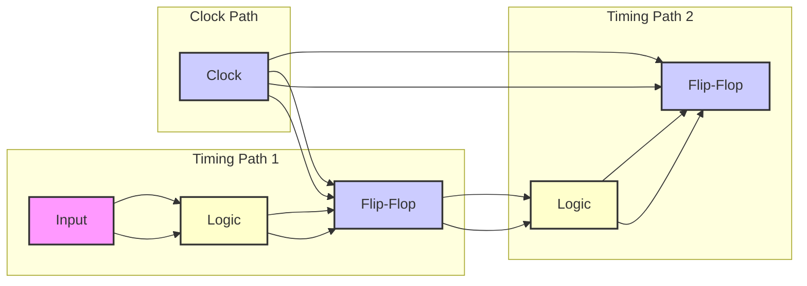
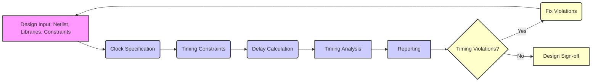
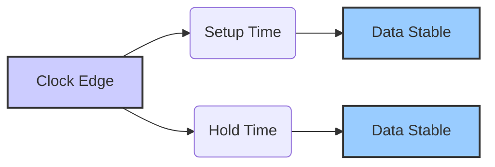

# Static Timing Analysis: A Deep Dive

## Table of Contents

1.  [Introduction to Static Timing Analysis (STA)](#introduction-to-static-timing-analysis-sta)
2.  [The Essence of Static Timing Analysis](#the-essence-of-static-timing-analysis)
3.  [Timing Paths: The Building Blocks of STA](#timing-paths-the-building-blocks-of-sta)
    *   [Startpoint](#startpoint)
    *   [Combinational Logic Network](#combinational-logic-network)
    *   [Endpoint](#endpoint)
    *    [Clock Path](#clock-path)
    *   [Data Path](#data-path)
    *   [Path Groups](#path-groups)
    *   [Timing Path Diagram](#timing-path-diagram)
4.  [Static Timing Analysis Flow](#static-timing-analysis-flow)
    *   [Design Input](#design-input)
        *   [Netlist](#netlist)
        *    [Libraries](#libraries)
        *   [Constraints](#constraints)
    *   [Clock Specification](#clock-specification)
    *   [Timing Constraints](#timing-constraints)
    *   [Delay Calculation](#delay-calculation)
         *   [Cell Delay](#cell-delay-flow)
         *   [Net Delay](#net-delay-flow)
         *   [Back Annotation](#back-annotation)
    *   [Timing Analysis](#timing-analysis)
    *   [Reporting](#reporting)
    *    [Iteration](#iteration)
    *   [STA Flow Diagram](#sta-flow-diagram-2)
5.  [In-Depth Look at Key Concepts](#in-depth-look-at-key-concepts)
     *   [Delay Calculation](#delay-calculation-concepts)
          *   [Cell Delay](#cell-delay-concepts)
          *  [Net Delay](#net-delay-concepts)
          *   [Slew (Transition Time)](#slew-transition-time)
          *   [Back Annotation](#back-annotation-concepts)
     *   [Timing Checks: Setup and Hold](#timing-checks-setup-and-hold)
          *   [Setup Time](#setup-time-concepts)
          *    [Hold Time](#hold-time-concepts)
          * [Setup and Hold Diagram](#setup-and-hold-diagram)
     *   [Timing Exceptions](#timing-exceptions)
         *    [False Paths](#false-paths)
         *   [Multicycle Paths](#multicycle-paths)
        *   [Minimum or Maximum Delay Paths](#minimum-or-maximum-delay-paths)
     *   [Clock Skew and Latency](#clock-skew-and-latency)
         *    [Clock Skew](#clock-skew)
        *   [Clock Latency](#clock-latency)
     *    [Path-Based Analysis (PBA)](#path-based-analysis-pba)
     *    [Multivoltage Analysis](#multivoltage-analysis)
     *  [Hierarchical Analysis](#hierarchical-analysis)
6.  [PrimeTime and Its Commands](#primetime-and-its-commands)
    *   [Key PrimeTime Commands](#key-primetime-commands)
7.  [Timing Report Analysis: Deep Dive](#timing-report-analysis-deep-dive)
    *   [Typical Timing Report](#typical-timing-report)
8.  [Variables and Attributes](#variables-and-attributes)
    *   [Key Attributes](#key-attributes)
    *    [Important Variables](#important-variables)
9.  [Conclusion](#conclusion)

## Introduction to Static Timing Analysis (STA)

Static Timing Analysis (STA) is a crucial verification method in digital circuit design, ensuring that a design operates correctly at its intended speed. Unlike dynamic simulation, which verifies functionality with specific input vectors, STA exhaustively analyzes all possible timing paths to identify potential timing violations. This approach makes it a sign-off criterion for many ASIC vendors.

## The Essence of Static Timing Analysis

At its core, STA involves:

*   **Identifying Timing Paths:** Breaking down a design into discrete paths.
*   **Delay Calculation:** Computing the signal propagation delay along each path, considering both cell and net delays.
*   **Timing Checks:** Verifying these delays against predefined timing constraints to detect setup and hold violations.

STA does not verify the functionality of the circuit, but only its timing.

## Timing Paths: The Building Blocks of STA

A timing path is a sequence of elements that a signal travels through from a starting point to an ending point. Each path consists of:

### Startpoint

*   Where the data is launched by a clock edge or where data must be available at a specific time.
*   This can be an input port or a register clock pin.

### Combinational Logic Network

*   Elements that process the signal without memory.
*   These can be AND, OR, XOR gates, and inverters, but not flip-flops, latches, or RAM.

### Endpoint

*   Where data is captured by a clock edge or where data must be available at a specific time.
*   This can be a register data input pin or an output port.

### Clock Path

*   The path the clock signal takes to reach the sequential elements.
*   Clock latency and skew are important factors to consider.

### Data Path

*   The path taken by the data signal.

### Path Groups

*   These paths are categorized into path groups for analysis.
*  These path groups may be analyzed separately. For example, the report\_timing command with the -group option reports the worst path in each of the listed path groups.

### Timing Path Diagram

Here is a diagram illustrating the concept of timing paths:

## Static Timing Analysis Flow

The static timing analysis flow generally consists of the following steps:

### Design Input

Loading the design netlist, constraints, and libraries.

#### Netlist

*   Structural description of the circuit in formats like Verilog or EDIF.

#### Libraries

*   Contain timing and functional data of cells in the design.

#### Constraints

*   Specified using SDC (Synopsys Design Constraints) or equivalent formats.

### Clock Specification

*   Defining the clocks, their periods, and waveforms.
*  This includes `create_clock`, `set_clock_uncertainty`, `set_clock_latency`, and `set_clock_transition` commands.

### Timing Constraints

*   Defining input and output delays, maximum and minimum pulse widths, and other timing requirements.
*   Commands like `set_input_delay`, `set_output_delay`, `set_min_pulse_width`, `set_max_capacitance`, and `set_max_transition` are used.

### Delay Calculation

#### Cell Delay

*   Calculated based on delay tables in the library.
*  In the absence of back-annotated delay information (from an SDF file), the tool calculates the cell delay from delay tables provided in the logic library for the cell.

#### Net Delay

*   After layout, actual delays can be back-annotated into the design through SDF files using the `read_sdf` command.
*    Back annotation can include detailed parasitics (resistance and capacitance) from the routed layout.

#### Back Annotation
*   The process of reading delay or parasitic resistance and capacitance values from an external file (SDF/SPEF) into the tool for timing analysis.

### Timing Analysis

*   Performing timing checks for setup and hold violations.

### Reporting

*   Generating reports that detail timing violations, slack, and path delays.
* The `report_timing` command is used to generate detailed timing reports.

### Iteration

*   Iterating through the design and analysis flow to eliminate any timing violations.

### STA Flow Diagram

Here's a diagram summarizing the STA flow:

## In-Depth Look at Key Concepts

### Delay Calculation

* The delay of a timing path is the sum of all cell delays and net delays in that path.

#### Cell Delay
*  The time taken for the signal to propagate through a gate.
*  Calculated based on delay tables in the library, which are functions of input slew and output load.

#### Net Delay
*   The delay caused by the interconnect.
*   Determined by the resistance and capacitance of the interconnect. After layout, this can be back-annotated.

#### Slew (Transition Time)
* The rate of change of a signal.
* Slew is crucial for accurate delay calculations.

#### Back Annotation
* The process of reading delay or parasitic resistance and capacitance values from an external file (SDF/SPEF) into the tool for timing analysis.

### Timing Checks: Setup and Hold

The most fundamental timing checks are setup and hold:

#### Setup Time
* The minimum amount of time that the data must be stable before the clock edge to be reliably captured by a flip-flop.
* If this is violated, data may not be captured correctly.

#### Hold Time
* The minimum amount of time the data must be stable after the clock edge.
* If this is violated, the flip-flop can become metastable.

#### Setup and Hold Diagram
Here's a diagram illustrating setup and hold time:

### Timing Exceptions

Not all paths must adhere to single-cycle timing constraints. Timing exceptions specify paths that have special timing requirements.

#### False Paths

*   Paths that are never sensitized and can be ignored by STA.

#### Multicycle Paths

*   Paths designed to take more than one clock cycle.

#### Minimum or Maximum Delay Paths

*   Paths that require an explicitly specified minimum or maximum delay.

### Clock Skew and Latency

#### Clock Skew

*   The difference in arrival times of a clock signal at different registers.
*   Skew can negatively impact timing and can be fixed by careful clock tree design.

#### Clock Latency

*   The time it takes for the clock signal to propagate from its source to a register.

A good clock tree has minimal skew, and timing violations due to skew should be fixable with minimal effort, and there should be no DRC and LVS violations.

### Path-Based Analysis (PBA)

*   PBA analyzes specific paths in isolation.
*   It helps reduce pessimism by focusing on the critical paths rather than assuming the worst for every path, and performs path-specific slew propagation.
*   By recalculating the timing in a path, without considering outside paths, it can improve accuracy.
*  Exhaustive PBA is computationally intensive and should be used when approaching design signoff.

### Multivoltage Analysis

*   Some modern designs have multiple voltage domains, which can impact timing.
*   Simultaneous Multivoltage Analysis (SMVA) or Dynamic Voltage and Frequency Scaling (DVFS) can analyze these designs, considering the voltage configuration on the timing paths.

### Hierarchical Analysis

*   For very large designs, timing analysis is often done hierarchically, breaking the design into blocks.
*   HyperScale analysis is a technique that captures details of paths starting from side inputs (internal start points) and the paths ending at stub pins (internal endpoints), at the block level for use in top-level analysis.

## PrimeTime and Its Commands

PrimeTime (PT) is a popular static timing analysis tool from Synopsys.

### Key PrimeTime Commands

*   `report_timing`: Generates detailed timing reports. Options include `-path_type`, `-delay_type`, `-max_paths`, `-from`, `-to`, `-through`.
*   `create_clock`: Defines a clock source in the design.
*   `set_input_delay`, `set_output_delay`: Specify delays at input and output ports.
*   `set_multicycle_path`: Defines paths that take more than one clock cycle.
*   `set_false_path`: Defines paths that can be ignored for timing.
*   `read_sdf`: Reads delay information from SDF files.
*   `update_timing`: Updates the timing information.
*  `get_timing_paths`: Creates a collection of timing paths for further analysis.
* `analyze_paths`: Identifies pins involved in specified paths and ranks the information.
* `report_clock`: Reports information about clocks and generated clocks.

## Timing Report Analysis: Deep Dive

A timing report provides detailed information on clock and data paths.

### Typical Timing Report

A typical report shows:

*   **Startpoint and Endpoint:** The start and end of the timing path.
*   **Path Group:** The group that the path belongs to.
*  **Path Type:** Whether it's a max (setup) or min (hold) check.
*   **Point:** The individual elements along the path.
*   **Incr:** The incremental delay of that specific element.
*   **Path:** The accumulated delay up to that point.
*   **Data Arrival Time:** The time at which the signal arrives at the endpoint of the path.
*   **Data Required Time:** The time at which the signal is required to be present at the endpoint of the path.
*   **Slack:** The difference between the required arrival time and the actual arrival time. A negative slack indicates a timing violation.
*   Slack is calculated as: Data Required Time - Data Arrival Time.
*   **Clock Network Delay:** The delay in the clock path.
*   **Library Setup Time:** The setup time requirement for the capture device.

The provided example of a timing report is included in the original text.

## Variables and Attributes

PrimeTime has numerous variables and attributes that control the behavior and provide information for STA.

### Key Attributes

*   `slack`: The difference between the required and actual arrival time.
*   `clock_uncertainty`: The uncertainty in the clock signal.
*   `endpoint`: The endpoint of the timing path.
*   `endpoint_clock`: The clock that is connected to the endpoint of the path.
*  `endpoint_clock_close_edge_type` and `endpoint_clock_open_edge_value`: Provide information about the capturing clock edge.
*  `data_arrival_time` and `data_required_time`: Arrival and required times at the endpoint.
*   `normalized_slack`: The slack of the timing path, normalized based on the clock period.
*   `required`: Returns the required time at the endpoint of the timing path.
*   `route_length`: Returns the total route length of the timing path.

### Important Variables

*   `timing_max_normalization_cycles`: Limits propagation delay along paths for normalized slack analysis.
*   `timing_enable_dvd_analysis`: Enables dynamic voltage drop analysis.
*   `timing_report_use_worst_parallel_cell_arc`: When set to true, the report_timing command uses only the worst arc in each sense set of parallel arcs for path tracing.
* `timing_keep_waveform_on_points`: When set to true, the waveform data will be available for each timing point.
*   `timing_report_hier_stub_pin_paths`: When set to true, paths ending at HyperScale stub pins are reported in their own group.
*   `hier_enable_detailed_side_input_path_timing`: When set to true, the tool captures and annotates all timing data propagated at side input pins during HyperScale block data reduction.

## Conclusion

Static timing analysis is a complex but indispensable process for ensuring that digital designs meet their performance requirements. By meticulously analyzing timing paths, calculating delays, and checking for violations, STA provides a rigorous approach to timing verification. PrimeTime, with its vast array of commands, variables, and attributes, offers the flexibility and control needed for a successful STA process. Understanding these concepts and the associated tool functionalities is crucial for any designer working on high-performance integrated circuits.
