# STA Interview Guide: A Comprehensive Deep Dive

## Table of Contents

1.  [Introduction to STA](#introduction-to-sta)
2.  [What is STA?](#what-is-sta)
    *   [Question W1: What is STA (Static Timing Analysis)?](#question-w1-what-is-sta-static-timing-analysis)
    *   [Question W2: What are all the items that are checked by static timing analysis?](#question-w2-what-are-all-the-items-that-are-checked-by-static-timing-analysis)
3.  [Setup and Hold Time Violations](#setup-and-hold-time-violations)
    *   [Question S1: Describe a timing path.](#question-s1-describe-a-timing-path)
    *  [Timing Path Diagram](#timing-path-diagram)
    *   [Question S2: What are different types of timing paths?](#question-s2-what-are-different-types-of-timing-paths)
    *   [Question S3: What is a launch edge?](#question-s3-what-is-a-launch-edge)
    *   [Launch and Capture Edge Diagram](#launch-and-capture-edge-diagram)
    *   [Question S4: What is a capture edge?](#question-s4-what-is-a-capture-edge)
    *   [Question S5: What is setup time?](#question-s5-what-is-setup-time)
    *   [Question S6: What is hold time?](#question-s6-what-is-hold-time)
    *   [Question S7: What does the setup time of a flop depend upon?](#question-s7-what-does-the-setup-time-of-a-flop-depend-upon)
    *   [Question S8: What does the hold time of a flip-flop depend upon?](#question-s8-what-does-the-hold-time-of-a-flip-flop-depend-upon)
    *   [Question S9: Explain signal timing propagation from one flip-flop to another flip-flop through combinational delay.](#question-s9-explain-signal-timing-propagation-from-one-flip-flop-to-another-flip-flop-through-combinational-delay)
      *  [Signal Propagation Diagram](#signal-propagation-diagram)
    *   [Question S10: Explain setup failure to a flip-flop.](#question-s10-explain-setup-failure-to-a-flip-flop)
        * [Setup Failure Diagram](#setup-failure-diagram)
    *   [Question S11: Explain hold failure to a flip-flop.](#question-s11-explain-hold-failure-to-a-flip-flop)
       * [Hold Failure Diagram](#hold-failure-diagram)
    *   [Question S12: If a hold violation exists in a design, is it OK to sign off the design? If not, why?](#question-s12-if-a-hold-violation-exists-in-a-design-is-it-ok-to-sign-off-the-design-if-not-why)
    *   [Question S13: What are setup and hold checks for clock gating and why are they needed?](#question-s13-what-are-setup-and-hold-checks-for-clock-gating-and-why-are-they-needed)
       *  [Clock Gating Diagram](#clock-gating-diagram)
    *   [Question S14: What determines the max frequency a digital design will work on? Why is hold time not included in the calculation for the above?](#question-s14-what-determines-the-max-frequency-a-digital-design-will-work-on-why-hold-time-is-not-included-in-the-calculation-for-the-above)
    *   [Question S15: One chip which came back after being manufactured fails a setup test and another one fails a hold test. Which one may still be used, how and why?](#question-s15-one-chip-which-came-back-after-being-manufactured-fails-a-setup-test-and-another-one-fails-a-hold-test-which-one-may-still-be-used-how-and-why)
        * [Setup Failure Frequency Diagram](#setup-failure-frequency-diagram)
         * [Hold Failure Frequency Diagram](#hold-failure-frequency-diagram)
    *   [Question S16: What is the Max Timing Equation?](#question-s16-what-is-the-max-timing-equation)
      * [Max Timing Diagram](#max-timing-diagram)
    *   [Question S17: What is the Min Timing Equation?](#question-s17-what-is-the-min-timing-equation)
       * [Min Timing Diagram](#min-timing-diagram)
    * [Question S18: Is the clock period enough for the given circuit?](#question-s18-is-the-clock-period-enough-for-the-given-circuit)
       * [Clock Frequency Diagram](#clock-frequency-diagram)
    *  [Question S19: What is reset recovery time?](#question-s19-what-is-reset-recovery-time)
       * [Reset Recovery Time Diagram](#reset-recovery-time-diagram)
    *  [Question S20: What is reset removal time?](#question-s20-what-is-reset-removal-time)
       * [Reset Removal Time Diagram](#reset-removal-time-diagram)
     *  [Question S21: Given a setup check from a launch element to a capture element, how does the timing analysis tool decide to perform the hold check?](#question-s21-given-a-setup-check-from-a-launch-element-to-a-capture-element-how-does-the-timing-analysis-tool-decide-to-perform-the-hold-check)
         * [Hold and Setup clock Diagram](#hold-and-setup-clock-diagram)
     *   [Question S22: What type of setup and hold checks will be performed when the launch and capture clocks are not of the same frequency?](#question-s22-what-type-of-setup-and-hold-checks-will-be-performed-when-launch-and-capture-clock-are-not-of-the-same-frequency)
       * [Setup and Hold Clock Edges Diagram](#setup-and-hold-clock-edges-diagram)
    *   [Question S23: Are clock domain crossing issues detected by the STA tool?](#question-s23-are-clock-domain-crossing-issues-detected-by-sta-tool)
    *  [Question S24: How does a lockup latch help with avoiding hold violations?](#question-s24-how-does-a-lockup-latch-help-with-avoiding-hold-violations)
         *  [Lock Up Latch Diagram](#lock-up-latch-diagram)
           * [Test Clock Hold Violation Diagram](#test-clock-hold-violation-diagram)
          * [Inter Scan Chain Lock Up Latch Diagram](#inter-scan-chain-lock-up-latch-diagram)
    *    [Question S25: Does the location of the lockup latch matter? What if in the previous example you moved the lockup latch from near the launch flop to the capture flop?](#question-s25-does-the-location-of-the-lockup-latch-matter-what-if-in-the-previous-example-you-moved-the-lockup-latch-from-near-the-launch-flop-to-the-capture-flop)
          * [Timing Path Split After Lockup Diagram](#timing-path-split-after-lockup-diagram)
            *  [Wrong Lockup Latch Diagram](#wrong-lockup-latch-diagram)
    *   [Question S26: What are your options to fix a timing path?](#question-s26-what-are-your-options-to-fix-a-timing-path)
    *   [Question S27: By default, Design Compiler (DC) tries to optimize the path with the worst violation. Is there anything that can be done to make it work on more paths than just the worst?](#question-s27-by-default-design-compiler-dc-tries-to-optimize-the-path-with-worst-violation-is-there-anything-can-be-done-to-make-it-work-on-more-paths-than-just-worse)
4.  [Timing Exceptions (Overrides)](#timing-exceptions-overrides)
    *   [Question TE1: What are multi-cycle paths?](#question-te1-what-are-multi-cycle-paths)
        * [Single Cycle Timing Path Diagram](#single-cycle-timing-path-diagram)
         * [Multi Cycle Timing Path Diagram](#multi-cycle-timing-path-diagram)
    *   [Question TE2: What are false paths?](#question-te2-what-are-false-paths)
        * [False Timing Path Diagram 1](#false-timing-path-diagram-1)
        * [False Timing Path Diagram 2](#false-timing-path-diagram-2)
    *   [Question TE3: What happens if a multicycle exception is provided only for setup or max time in PrimeTime?](#question-te3-what-happens-if-a-multicycle-exception-is-provided-only-for-setup-or-max-time-in-primetime)
       * [Multicycle Setup Exception Problem Diagram](#multicycle-setup-exception-problem-diagram)
5.  [Signal Integrity](#signal-integrity)
    *   [Question SI1: What is signal integrity?](#question-si1-what-is-signal-integrity)
        * [Wire to Wire Coupling Diagram](#wire-to-wire-coupling-diagram)
    *   [Question SI2: How to fix crosstalk glitch?](#question-si2-how-to-fix-crosstalk-glitch)
    *   [Question SI3: How is signal integrity (SI) related to timing? How do you improve timing from SI effects?](#question-si3-how-is-signal-integrity-si-related-to-timing-how-do-you-improve-timing-from-si-effects)
6.  [Variation](#variation)
    *   [Question V1: What is on-chip variation?](#question-v1-what-is-on-chip-variation)
       *   [Dishing and Erosion Diagram](#dishing-and-erosion-diagram)
          *   [Isolated Wires Diagram](#isolated-wires-diagram)
7. [Clocks](#clocks)
    *   [Question C1: What are the main clock distribution styles used?](#question-c1-what-are-the-main-clock-distribution-styles-used)
    *   [Question C2: What is a Clock mesh or clock grid distribution system?](#question-c2-what-is-clock-mesh-or-clock-grid-distribution-system)
       *  [Clock Distribution from PLL Diagram](#clock-distribution-from-pll-diagram)
         *  [Clock Mesh Distribution Diagram](#clock-mesh-distribution-diagram)
    *   [Question C3: What is a clock tree distribution system?](#question-c3-what-is-a-clock-tree-distribution-system)
         * [Clock Tree Distribution Diagram](#clock-tree-distribution-diagram)
    *   [Question C4: Explain CTS (Clock Tree Synthesis) flow.](#question-c4-explain-cts-clock-tree-synthesis-flow)
    *  [Question C5: What is clock skew?](#question-c5-what-is-clock-skew)
         *   [False Data Capture due to Clock Skew Diagram](#false-data-capture-due-to-clock-skew-diagram)
    *   [Question C6: What is clock gating?](#question-c6-what-is-clock-gating)
        *   [Gated Clock Diagram](#gated-clock-diagram)
    *   [Question C7: Why is clock gating done?](#question-c7-why-is-clock-gating-done)
    *   [Question C8: What does CRPR stand for and what does it mean?](#question-c8-what-does-crpr-stand-for-and-what-does-it-mean)
      *  [CRPR Diagram](#crpr-diagram)
8.  [Metastability](#metastability)
    *   [Question M1: What is metastability and what are its effects?](#question-m1-what-is-metastability-and-what-are-its-effects)
        *  [D Latch Diagram](#d-latch-diagram)
         *   [Inverter Voltage Transfer Curve Diagram](#inverter-voltage-transfer-curve-diagram)
         *    [Inverter Loop Voltage Transfer Curve Diagram](#inverter-loop-voltage-transfer-curve-diagram)
    *   [Question M2: How to avoid metastability?](#question-m2-how-to-avoid-metastability)
      *   [Metastability Hardened Flops Diagram](#metastability-hardened-flops-diagram)
    *   [Question M3: How do you synchronize between 2 clock domains?](#question-m3-how-do-you-synchronize-between-2-clock-domains)
    *   [Question M4: Explain the working of a FIFO.](#question-m4-explain-the-working-of-a-fifo)
       * [Asynchronous FIFO Diagram](#asynchronous-fifo-diagram)
    * [Question D27: How is FIFO depth/size determined?](#question-d27-how-is-fifo-depthsize-determined)
9.  [Miscellaneous](#miscellaneous)
    *   [Question MI1: Design a flip-flop using a mux.](#question-mi1-design-a-flip-flop-using-a-mux)
       * [Latch Using Mux Diagram](#latch-using-mux-diagram)
          * [Master Slave Flip Flop Diagram](#master-slave-flip-flop-diagram)
          * [Flip Flop Using Mux Diagram](#flip-flop-using-mux-diagram)
    *  [Question MI2: How will a flip-flop respond if the clock and D input of a D flip-flop are shorted and clock connected to this shorted input?](#question-mi2-how-will-a-flip-flop-respond-if-the-clock-and-d-input-of-a-d-flip-flop-are-shorted-and-clock-connected-to-this-shorted-input)
    *   [Question MI3: How do you fix a timing path from latch to latch?](#question-mi3-how-do-you-fix-a-timing-path-from-latch-to-latch)
    *   [Question MI4: What is the difference between a latch and a flip-flop?](#question-mi4-what-is-the-difference-between-a-latch-and-a-flip-flop)
    *  [Question MI5: What happens to delay if you increase load capacitance?](#question-mi5-what-happens-to-delay-if-you-increase-load-capacitance)
     *   [Question MI6: The STA tool reports a hold violation on the following circuit. What would you do?](#question-mi6-sta-tool-reports-a-hold-violation-on-following-circuit-what-would-you-do)
        *   [Hold Violation Circuit Diagram](#hold-violation-circuit-diagram)
     * [Question MI7: How much is the max fan out of a typical CMOS gate? Or alternatively, discuss the limiting factors.](#question-mi7-how-much-is-the-max-fan-out-of-a-typical-cmos-gate-or-alternatively-discuss-the-limiting-factors)
         *   [R and C Model of CMOS Inverter Diagram](#r-and-c-model-of-cmos-inverter-diagram)
         *   [Unit Size Inverter Driving a Size Inverter Diagram](#unit-size-inverter-driving-a-size-inverter-diagram)
           *   [Inverter R & C Model Diagram](#inverter-r-c-model-diagram)
          *  [Chain of Inverters Diagram](#chain-of-inverters-diagram)
         *    [Total Delay v/s Fanout Graph Diagram](#total-delay-v-s-fanout-graph-diagram)
    *   [Question MI8: How is RC delay modeled by tools? What are the RC delay models?](#question-mi8-how-is-rc-delayed-modelled-by-tools-what-are-the-rc-delay-models)
       *    [Elmore Delay Model Diagram](#elmore-delay-model-diagram)
     *  [Question MI9: What’s the equation for Elmore RC delay?](#question-mi9-whats-the-equation-for-elmore-rc-delay)
    *    [Question MI10: What is Statistical STA?](#question-mi10-what-is-statistical-sta)
10. [Conclusion](#conclusion)

## Introduction to STA

This guide provides a detailed explanation of Static Timing Analysis (STA) concepts and is designed to help students prepare for interviews in the VLSI domain. It covers essential topics from basic timing paths to advanced concepts like clock skew, metastability, and on-chip variation.

## What is STA?

### Question W1: What is STA (Static Timing Analysis)?

**Answer W1:** Static Timing Analysis (STA) is a technique for checking the timing of digital circuits. It calculates delays along different paths (both gate and wire delays) and compares them against timing requirements (clock period) to ensure the circuit works correctly. Unlike dynamic simulation which uses specific input patterns, STA uses simplified models for delays and performs a worst-case analysis to achieve high timing coverage. It uses inputs such as technology libraries, netlists, constraints, and parasitics. A good STA tool accurately predicts real-world silicon behavior.

### Question W2: What are all the items that are checked by static timing analysis?

**Answer W2:** STA primarily checks setup and hold times, and also verifies assumptions made during the analysis, such as:

*   **Setup Timing:** Ensures data arrives before the capture clock edge.
*   **Hold Timing:** Ensures data remains stable after the capture clock edge.
*  **Clock Gating Checks:**  Verifies correct operation of clock gating logic
*  **Min/Max Transition Times:** Ensures signal transitions are within acceptable limits.
*  **Min/Max Fanout:**  Verifies the load driven by each cell is within permissible limits.
*   **Max Capacitance:** Checks the load capacitance on the output of cells.
*   **Min/Max Timing Between Points:** Checks timing between two points on a timing path.
* **Latch Time Borrowing**: If time borrowing for the latch is as per the design.
*  **Clock pulse width**: To ensure the minimum pulse width is maintained.
*   **Clock waveform integrity**: Ensures there is no distortion in clock signal.

## Setup and Hold Time Violations

### Question S1: Describe a timing path.

**Answer S1:** A timing path in a standard cell-based design typically starts at a sequential element (flip-flop or latch) clock pin. The active clock edge at this element triggers a data change at its output (clock-to-Q delay). This data then passes through combinational logic and interconnect wires, accumulating delays along the way. The path ends at the input of a sampling sequential element, where data must meet setup and hold requirements against the sampling element’s clock. For paths in the same clock domain, both the generating and sampling clocks are derived from a single source. The actual starting point for analysis is where clocks branch off which is also called as point of divergence, but for simplifying we assume the clock to be ideal, which helps with analyzing timing paths from one sequential element to another sequential element.

### Timing Path Diagram

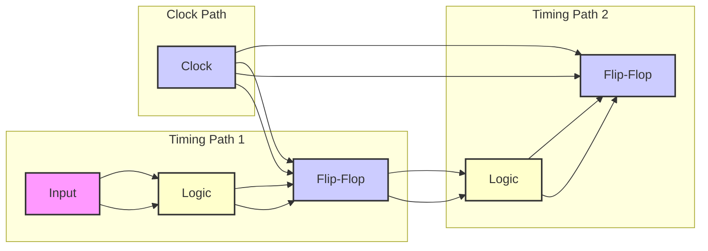

### Question S2: What are different types of timing paths?

**Answer S2:** A digital logic can be broken into various timing paths:

*   Clock pin to data pin of a register/latch.
*   Primary input to the data pin of a register/latch.
*  Clock pin of register to a primary output.
* Primary input to macro input pin.
* Macro output pin to primary output pin.
*  Macro output pin to another macro input pin.
*  A path passing through input pin and output pin of a block with combinational logic.

### Question S3: What is a launch edge?

**Answer S3:** In a synchronous design, activities occur within a clock cycle. Memory elements hold input values stable while computations are performed. The **launch edge** is the active clock edge that triggers data transfer at the output of a memory element, initiating data propagation through the combinational logic.

### Launch and Capture Edge Diagram

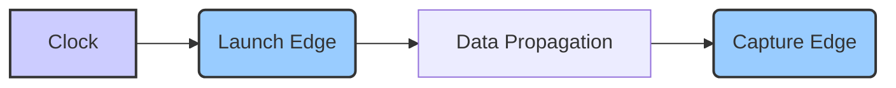

### Question S4: What is a capture edge?

**Answer S4:** The **capture edge** is the active clock edge that captures computed data at the input of the next memory element at the end of a clock cycle. This edge samples the data after it propagates through the logic. Data has to arrive at the capture flop before the active edge and it also has to remain stable for certain time after capture edge. If there is more than one clock cycle then the path is called as multicycle path.

### Question S5: What is setup time?

**Answer S5:** The **setup time** is the minimum time that input data must be stable *before* the active clock capture edge of a sequential element. This is required to prevent the element from entering a metastable state and capturing wrong values at the output.

### Question S6: What is hold time?

**Answer S6:** The **hold time** is the minimum time that input data must be held stable *after* the active clock capture edge deactivates. If data changes within the hold time window then the sequential element can capture wrong value at the output.

### Question S7: What does the setup time of a flop depend upon?

**Answer S7:** The setup time of a flip-flop depends upon:

*   Input data slope (slew).
*   Clock slope (slew).
*   Output load.

### Question S8: What does the hold time of a flip-flop depend upon?

**Answer S8:** The hold time of a flip-flop depends upon:

*   Input data slope (slew).
*   Clock slope (slew).
*   Output load.

### Question S9: Explain signal timing propagation from one flip-flop to another flip-flop through combinational delay.

**Answer S9:** Data moves from the output of a flip-flop (FF1_out), through combinational logic, and then reaches the input of another flip-flop (FF2_in). The logic in between must be fast enough for the signal transitions to propagate and to be captured correctly at FF2. The input data must arrive and become stable before the capture edge, which is the setup time. Setup issues occur when the combinational delay is too long. The max delay constraint sets how much time the signal can take to arrive. Slack (or margin) is the amount of time the signal is short of meeting the setup time.

### Signal Propagation Diagram

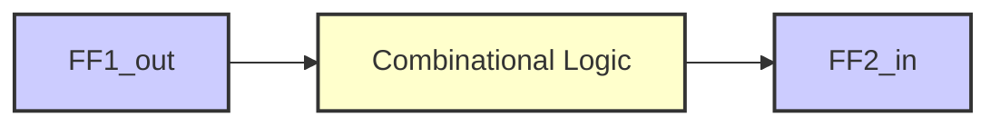

### Question S10: Explain setup failure to a flip-flop.

**Answer S10:** A setup failure happens when the data signal at a flip-flop's input changes too close to the capturing clock edge and violates the setup time. This results in a metastable state, where the flip-flop may capture an incorrect value and it will take sometime before the output of the flop settles down to the correct state. This occurs because of large delays in the combinational logic between two flops or fast clock.

### Setup Failure Diagram

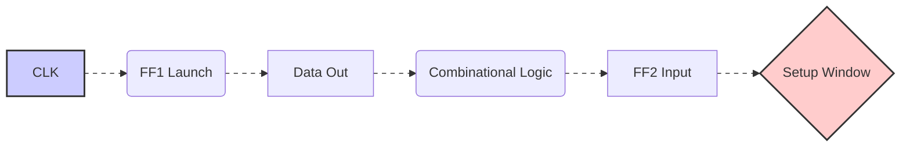

### Question S11: Explain hold failure to a flip-flop.

**Answer S11:** A hold failure occurs when data at a flip-flop's input changes too soon after the active clock edge and violates the hold time. This happens when combinational logic delay is too small. This can cause data from current clock cycle to sneak into the next clock cycle and also causes a metastable state at the output of the receiving flop which will cause the circuit to work incorrectly.

### Hold Failure Diagram

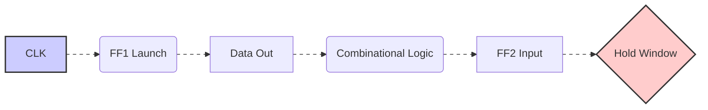

### Question S12: If a hold violation exists in a design, is it OK to sign off the design? If not, why?

**Answer S12:** No, it is **not** okay to sign off a design with hold violations. Hold violations are functional failures and are frequency independent. They can cause the design to capture unintended data and put the state machine into an unknown state.

### Question S13: What are setup and hold checks for clock gating and why are they needed?

**Answer S13:** Clock gating uses an enable signal to mask or unmask clock pulses using an AND gate. Setup and hold checks are needed to ensure that the enable signal doesn't chop off the rising clock edge or causes glitches and hence to make sure the clock pulses retain their shape.

### Clock Gating Diagram

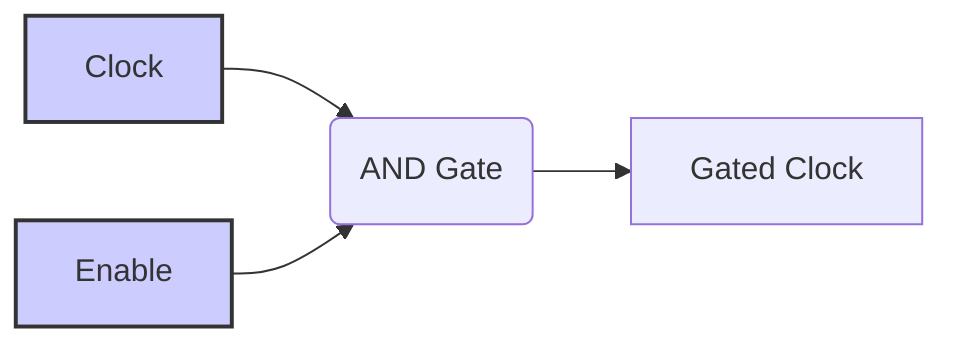

### Question S14: What determines the max frequency a digital design will work on? Why is hold time not included in the calculation for the above?

**Answer S14:** The maximum frequency a design will work on is determined by the worst-case setup time violation (max slack). Hold time is not a factor in determining the max frequency as hold violations are frequency independent. Setup failures are frequency dependent and can be fixed by reducing frequency. Hold failures are functional failures as the data can sneak into the next clock cycle.

### Question S15: One chip which came back after being manufactured fails a setup test and another one fails a hold test. Which one may still be used, how and why?

**Answer S15:** The chip that fails the setup test can still be used by reducing the clock frequency. The chip with hold failures can not be used as hold failures are frequency independent and can cause functional failures which can not be fixed by reducing frequency.

### Setup Failure Frequency Diagram

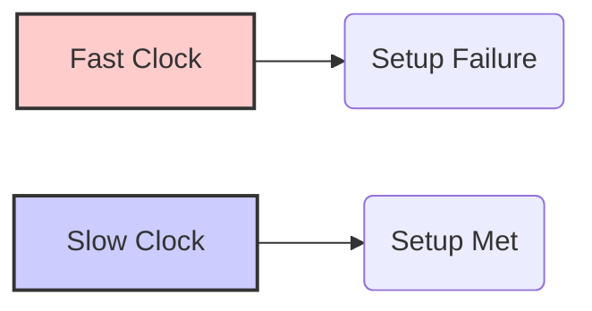

### Hold Failure Frequency Diagram

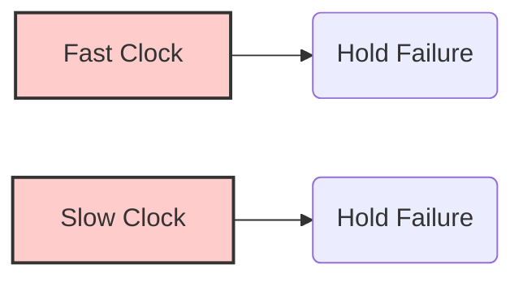

### Question S16: What is the Max Timing Equation?

**Answer S16:** The max timing equation calculates the setup slack. It is a check to see that the data arrives in time before the capture edge of the clock. The max margin (slack) = \[Source capture clock edge (One clock cycle) + Capture clock network fastest delay - Setup time - Max clock uncertainty ] - \[Source launch clock edge (0 ps) + Launch clock network slowest delay + Clock to Q slowest delay + Slowest path delay (cell + interconnect) ].

### Max Timing Diagram

```mermaid
graph LR
    A[Source Clock(Launch)] --> B(Launch Clock Network Delay);
     B --> C(Clock to Q Delay);
    C --> D(Path Delay);
     D --> E[Data Arrival Time];
     F[Source Clock(Capture)] --> G(Capture Clock Network Delay);
      G --> H(Library Setup time);
      H --> I(Clock Uncertainty);
      I --> J[Data Required Time];
    style A fill:#ccf,stroke:#333,stroke-width:2px
        style F fill:#ccf,stroke:#333,stroke-width:2px
    linkStyle 0,1,2,3,4,5,6,7 stroke-dasharray: 5 5
```

### Question S17: What is the Min Timing Equation?

**Answer S17:** The min timing equation ensures that the data launched from a flop is not captured by the receiving flop too soon and meets the hold time requirement. Min margin = \[Source clock launch clock edge(0ps) + Launch clock network fastest delay + Clock to Q fastest delay + Fastest path delay (cell + interconnect delays)] -\[Source clock launch edge(Source clock capture edge corresponding to the setup path -1 clock period, same as 0ps) + Capture clock network slowest delay + Capture flop library hold time + Hold time clock uncertainty]

### Min Timing Diagram

```mermaid
graph LR
    A[Source Clock(Launch)] --> B(Launch Clock Network Delay);
     B --> C(Clock to Q Delay);
    C --> D(Path Delay);
     D --> E[Data Arrival Time];
     F[Source Clock(Capture)] --> G(Capture Clock Network Delay);
      G --> H(Library Hold time);
      H --> I(Clock Uncertainty);
      I --> J[Data Required Time];
    style A fill:#ccf,stroke:#333,stroke-width:2px
        style F fill:#ccf,stroke:#333,stroke-width:2px
    linkStyle 0,1,2,3,4,5,6,7 stroke-dasharray: 5 5
```

### Question S18: Is the clock period enough for the given circuit?

**Answer S18:** Clock period is not enough if the Max margin is negative. This means there is setup time violation and data is not arriving before the setup requirement for the receiving flop and the frequency of operation is too high.

### Clock Frequency Diagram

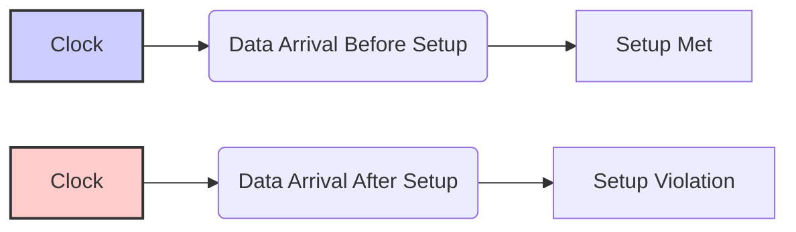

### Question S19: What is reset recovery time?

**Answer S19:** For a flip-flop with an asynchronous reset, the recovery time is the time the reset signal has to de-assert *before* the active edge of the clock. This ensures the flop comes out of reset properly.

### Reset Recovery Time Diagram

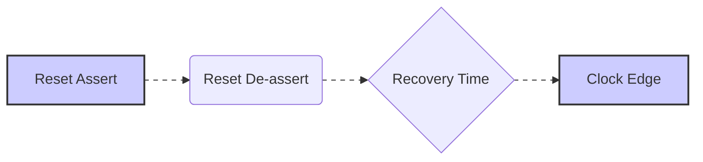

### Question S20: What is reset removal time?

**Answer S20:** Removal time is the time the reset de-assertion has to hold *after* the clock edge. This is similar to hold time requirement but is with respect to reset signal.

### Reset Removal Time Diagram

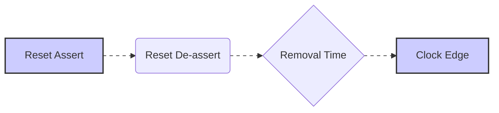

### Question S21: Given a setup check from a launch element to a capture element, how does the timing analysis tool decide to perform the hold check?

**Answer S21:** Hold check is performed with reference to setup check. The timing tool first finds the clock edges for setup check. Then it uses those edges to perform the hold check. The hold check is performed against a clock edge either one cycle before the setup capture edge or against the same clock edge of the setup launch, depending upon which ever is more stringent.

### Hold and Setup clock Diagram

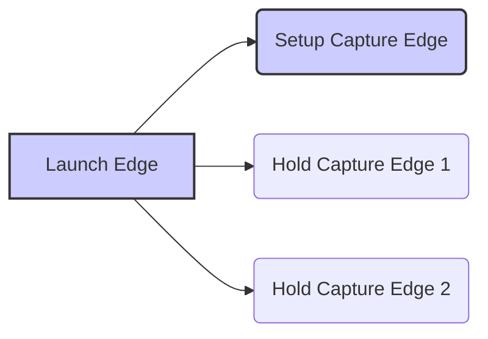

### Question S22: What type of setup and hold checks will be performed when the launch and capture clocks are not of the same frequency?

**Answer S22:** The STA tool will perform the worst case setup and hold check by calculating the shortest time between the launch and capture clock edges. For the hold checks, two scenarios are analyzed and the more stringent check is picked. In other words, tool will find the smallest time between launch and capture clock, which is more than zero for setup check, and will check setup with respect to the edge. Based on the setup check, it will use two scenarios for hold and pick the more stringent of the two.

### Setup and Hold Clock Edges Diagram

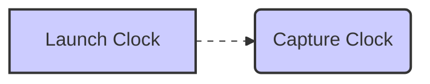

### Question S23: Are clock domain crossing issues detected by the STA tool?

**Answer S23:** No, clock domain crossing issues are **not** detected by STA tools. STA tools checks for setup and hold violations and it does not check for the proper synchronization between clock domains.

### Question S24: How does a lockup latch help with avoiding hold violations?

**Answer S24:** A lockup latch moves the launch edge from a rising edge to a falling edge (or vice versa), such that the hold check is performed with respect to a launch edge that is a clock phase apart from capture edge, maximizing the hold time protection and ensuring sufficient margin by pushing out the launch edge.

### Lock Up Latch Diagram


### Test Clock Hold Violation Diagram

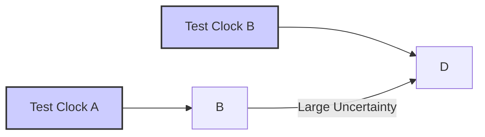

### Inter Scan Chain Lock Up Latch Diagram

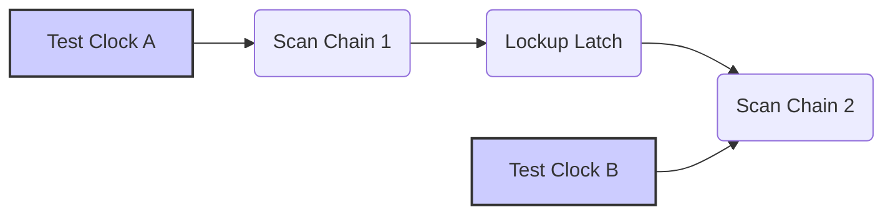

### Question S25: Does the location of the lockup latch matter? What if in the previous example you moved the lockup latch from near the launch flop to the capture flop?

**Answer S25:** Yes, the location matters. The lockup latch should be near the launch flop. Placing it near the capture flop will not fix the hold violation, and can introduce new hold violations. The goal is to create a data launch that is a clock phase apart from the capture edge.

### Timing Path Split After Lockup Diagram

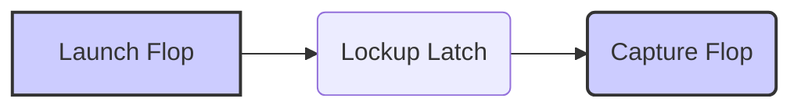

### Wrong Lockup Latch Diagram

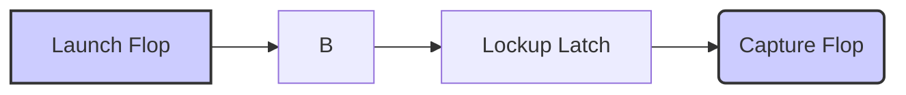

### Question S26: What are your options to fix a timing path?

**Answer S26:** Options for fixing a timing path include:

*   **Logic optimization:** Simplify or reduce the logic.
*   **Better placement:** Move logic closer.
*   **More pipelining:** Add flip-flops to reduce logic per cycle.
*  **Move logic to previous pipe stage**: Move logic before the launch flop if possible.
*  **Replicate Drivers**: Reduce load on slow driver.
*   **Parallelism in RTL:** Change serial to parallel operations.
*  **Use of Macro**: Map the logic to a faster memory like SRAM or register files.
*  **Synthesized if..elseif**: If ..elseif chains can be mapped to faster MUX structure.
*  **One hot state encoding**: Use one-hot encoding instead of binary to reduce gate delays.
*   **Physical design techniques:** Promote metal wires to higher levels, widen wires, or increase spacing.
*   **Power trade-offs:** Use low-threshold voltage cells or time borrowing.

### Question S27: By default, Design Compiler (DC) tries to optimize the path with the worst violation. Is there anything that can be done to make it work on more paths than just the worst?

**Answer S27:** You can use the `group_path` command and specify the `critical_range` option to make DC focus on a slack range and thus work on more paths than just the worst.

## Timing Exceptions (Overrides)

### Question TE1: What are multi-cycle paths?

**Answer TE1:**  By default, timing paths are assumed to be single-cycle long (data launched at the beginning of one cycle and captured at the end). When combinational logic delay exceeds one clock cycle, data must be launched every other clock cycle so the capture happens correctly after the data arrives. These are called multicycle paths and the timing tools need an exception to do the setup check correctly.

### Single Cycle Timing Path Diagram
```mermaid
graph LR
    A[Launch Edge] --> B(Data Propagation);
    B --> C(Capture Edge);
      style A fill:#ccf,stroke:#333,stroke-width:2px
     style C fill:#ccf,stroke:#333,stroke-width:2px
```

### Multi Cycle Timing Path Diagram
```mermaid
graph LR
    A[Launch Edge] --> B(Data Propagation);
    B --> C(Data Arrival);
     C --> D[Capture Edge];
      style A fill:#ccf,stroke:#333,stroke-width:2px
        style D fill:#ccf,stroke:#333,stroke-width:2px
    linkStyle 0,1,2 stroke-dasharray: 5 5
```

### Question TE2: What are false paths?

**Answer TE2:**  False paths are paths that will not be active at runtime and can be ignored by the STA tool. For example, a path might start from a functional clock and end at the data pin of a flip-flop clocked by a test clock, which are never active at the same time. This is a path that is false and should not be analyzed.

### False Timing Path Diagram 1

```mermaid
graph LR
    A[Functional Clock] --> B(FF Output);
    B --> C(Logic);
    C --> D[Test Clocked FF];
      style A fill:#ccf,stroke:#333,stroke-width:2px
          style D fill:#ccf,stroke:#333,stroke-width:2px
    linkStyle 0,1,2 stroke-dasharray: 5 5
```

### False Timing Path Diagram 2

```mermaid
graph LR
    A[Functional Clock] --> B(Mux);
     C[Test Clock] --> B;
    B --> D(FF Output);
    D --> E(Logic);
    E --> F[FF Input];
        style A fill:#ccf,stroke:#333,stroke-width:2px
           style C fill:#ccf,stroke:#333,stroke-width:2px
    linkStyle 0,1,2,3,4 stroke-dasharray: 5 5
```

### Question TE3: What happens if a multicycle exception is provided only for setup or max time in PrimeTime?

**Answer TE3:** If a multicycle exception is provided only for setup time, PrimeTime pushes out the capture edge, but then incorrectly infers the hold check edge too. To avoid incorrect hold checks a multicycle exception must be provided for both setup and hold paths.

### Multicycle Setup Exception Problem Diagram

```mermaid
graph LR
    A[Normal] --> B(Correct Setup and Hold);
     C[Setup Only MCP] --> D(Wrong Hold);
     E[Setup & Hold MCP] --> F(Correct Setup and Hold);
    style A fill:#ccf,stroke:#333,stroke-width:2px
    style E fill:#ccf,stroke:#333,stroke-width:2px
        style D fill:#fcc,stroke:#333,stroke-width:2px
     linkStyle 0,1,2 stroke-dasharray: 5 5
```

## Signal Integrity

### Question SI1: What is signal integrity?

**Answer SI1:** Signal integrity issues happen due to cross-coupling effects (crosstalk) between wires. A switching signal on one wire causes a glitch on a neighboring wire, resulting in loss of signal integrity.

### Wire to Wire Coupling Diagram

```mermaid
graph LR
    A[Wire a] --> B(Wire b);
    style A fill:#ccf,stroke:#333,stroke-width:2px
        style B fill:#ccf,stroke:#333,stroke-width:2px
    linkStyle 0 stroke-dasharray: 5 5
```

### Question SI2: How to fix crosstalk glitch?

**Answer SI2:**
*   Increase spacing between the wires.
*   Use stronger drivers for the victim nets.
*   Route nets with a jogged formation.

### Question SI3: How is signal integrity (SI) related to timing? How do you improve timing from SI effects?

**Answer SI3:**  Crosstalk can cause "crosstalk delta delay" or "crosstalk glitch" on a neighboring net. The delay can cause timing violations, while glitches can lead to incorrect data capture. To reduce these effects, increase wire spacing, decrease aggressor driver strength, or increase victim driver strength.

## Variation

### Question V1: What is on-chip variation?

**Answer V1:** On-chip variation refers to the fact that devices and interconnect characteristics are not uniform across a chip due to manufacturing complexities. Different parts of a chip experience variations in threshold voltage, channel length, interconnect, IR drop, and temperature. This can lead to differences in performance and can affect the timing of circuits.

### Dishing and Erosion Diagram

```mermaid
graph LR
    A[Copper Line] --> B(Dishing);
     C[Dielectric Material] --> D(Erosion);
    style A fill:#ccf,stroke:#333,stroke-width:2px
    style C fill:#ccf,stroke:#333,stroke-width:2px
```

### Isolated Wires Diagram

```mermaid
graph LR
    A[Isolated Wire] --> B(Wider Wire);
    style A fill:#ccf,stroke:#333,stroke-width:2px
```

## Clocks

### Question C1: What are the main clock distribution styles used?

**Answer C1:** Two main clock distribution styles are:

*   Clock mesh/grid.
*   Clock tree synthesis (CTS) or clock tree distribution.

### Question C2: What is a Clock mesh or clock grid distribution system?

**Answer C2:** A clock mesh/grid aims to provide a fixed delay from the clock source to all clock receivers by balancing the number of stages from the source to distribution and by having same stage delay for all stages. It typically consists of a two step distribution where the clock is distributed from the PLL to all blocks, then a second level of distribution from the block boundary to inside of the block is achieved using a mesh or grid of clock buffers.

### Clock Distribution from PLL Diagram

```mermaid
graph LR
    A[PLL] --> B(Clock Buffers);
        B --> C[Block Boundaries]
    style A fill:#ccf,stroke:#333,stroke-width:2px
```

### Clock Mesh Distribution Diagram

```mermaid
graph LR
    A[PLL] --> B(Buffer Stage 1);
    B --> C(Buffer Stage 2);
    C --> D(Buffer Stage 3);
     D --> E[Flops];
     style A fill:#ccf,stroke:#333,stroke-width:2px
     style E fill:#ccf,stroke:#333,stroke-width:2px
```

### Question C3: What is a clock tree distribution system?

**Answer C3:** A clock tree distribution system uses a clock buffer tree from the source clock driver to all receivers. This system aims to have an optimal number of branch stages to each clock receiver.

### Clock Tree Distribution Diagram

```mermaid
graph LR
    A[Clock Source] --> B(Buffer 1);
    B --> C(Buffer 2);
    B --> D(Buffer 3);
    C --> E[Flop 1];
    D --> F[Flop 2];
    style A fill:#ccf,stroke:#333,stroke-width:2px
    style E fill:#ccf,stroke:#333,stroke-width:2px
       style F fill:#ccf,stroke:#333,stroke-width:2px
```

### Question C4: Explain CTS (Clock Tree Synthesis) flow.

**Answer C4:** Clock Tree Synthesis (CTS) is a design step to implement the clock tree distribution. It aims to minimize clock skew and insertion delay. The tools use ideal clock arrival times before CTS, and real clock arrival times after CTS.

### Question C5: What is clock skew?

**Answer C5:** Clock skew is the difference in arrival times of the same clock signal at different points in the circuit. It arises due to device variations, differing interconnect delays, and temperature variations. Clock skew can both help or hurt performance based on the timing path requirements.

### False Data Capture due to Clock Skew Diagram

```mermaid
graph LR
    A[Clock Source] --> B(Clock 1);
    A --> C(Clock 2);
    B --> D(FF1);
    C --> E(FF2);
     D --> F[Data Path];
       F --> E
     style A fill:#ccf,stroke:#333,stroke-width:2px
     style D fill:#ccf,stroke:#333,stroke-width:2px
       style E fill:#ccf,stroke:#333,stroke-width:2px
```

### Question C6: What is clock gating?

**Answer C6:** Clock gating is a power-saving technique that uses a logic gate to mask clock pulses, preventing the clock from toggling when not needed. This helps in reducing power consumption as clock is usually a high fanout network.

### Gated Clock Diagram

```mermaid
graph LR
    A[Clock] --> B(AND Gate);
     C[Enable] --> B;
    B --> D[Gated Clock];
    style A fill:#ccf,stroke:#333,stroke-width:2px
    style C fill:#ccf,stroke:#333,stroke-width:2px
```

### Question C7: Why is clock gating done?

**Answer C7:** Clock gating is done to reduce dynamic power consumption by turning off the clock to inactive circuit blocks and prevent unnecessary clock toggling.

### Question C8: What does CRPR stand for and what does it mean?

**Answer C8:** CRPR stands for Clock Reconvergence Pessimism Removal. It's a technique used in STA to reduce pessimism by accounting for the fact that common clock paths cannot have both the slowest and fastest delays simultaneously. The tool will provide credit to the path for the amount of pessimism removed using CRPR.

### CRPR Diagram

```mermaid
graph LR
    A[Clock Source] --> B(Common Path);
    B --> C(Launch Clock Path);
    B --> D(Capture Clock Path);
        style A fill:#ccf,stroke:#333,stroke-width:2px
```

## Metastability

### Question M1: What is metastability and what are its effects?

**Answer M1:** Metastability occurs when a flip-flop's input violates setup or hold times. The output becomes unpredictable and takes an indeterminate time to settle to a valid state. This is because of the feedback loop in the latch and the metastable point in the transfer function.

### D Latch Diagram

```mermaid
graph LR
    A[D] --> B(Pass Gate);
      B --> C(Inverter Loop);
     style A fill:#ccf,stroke:#333,stroke-width:2px
```

### Inverter Voltage Transfer Curve Diagram

```mermaid
graph LR
    A[VIn] --> B(VOut)
    style A fill:#ccf,stroke:#333,stroke-width:2px
```

### Inverter Loop Voltage Transfer Curve Diagram

```mermaid
graph LR
    A[Inverter 1] --> B(Inverter 2);
    B --> A;
     style A fill:#ccf,stroke:#333,stroke-width:2px
```

### Question M2: How to avoid metastability?

**Answer M2:** Metastability can be minimized by ensuring the inputs meet setup and hold requirements. When this isn't possible (e.g., clock domain crossings), use a series of back-to-back flip-flops (metastability hardened flops) to provide extra clock cycles for the flip-flops to recover from metastable state.

### Metastability Hardened Flops Diagram

```mermaid
graph LR
    A[Input] --> B(FF1);
    B --> C(FF2);
     C --> D[Output];
        style A fill:#ccf,stroke:#333,stroke-width:2px
        style D fill:#ccf,stroke:#333,stroke-width:2px
```

### Question M3: How do you synchronize between 2 clock domains?

**Answer M3:** Synchronization between two clock domains is done using:

1.  Asynchronous FIFOs.
2.  Synchronizers (metastability hardened flops).

### Question M4: Explain the working of a FIFO.

**Answer M4:** An Asynchronous FIFO is used for high-throughput data transfer between different clock domains. It consists of a storage element with two interfaces: one for writing data (write clock domain) and one for reading data (read clock domain). FIFO full/empty signals (synchronized to their respective clock domains using synchronizers) control the data flow.

### Asynchronous FIFO Diagram

```mermaid
graph LR
    A[Block A] --> B(FIFO Write);
    C[Block B] --> D(FIFO Read);
    B --> E(FIFO);
     E --> D;
        style A fill:#ccf,stroke:#333,stroke-width:2px
        style C fill:#ccf,stroke:#333,stroke-width:2px
           style E fill:#ccf,stroke:#333,stroke-width:2px
```

### Question D27: How is FIFO depth/size determined?

**Answer D27:** The size of a FIFO is determined by the read/write clock frequencies, their skew, and data rates. It has to handle the case where writing happens at the maximum rate and reading happens at the minimum rate, and accommodate all data transfers even during such scenarios.

## Miscellaneous

### Question MI1: Design a flip-flop using a mux.

**Answer MI1:** A flip-flop can be created using two back-to-back latches in a master-slave configuration. A latch can be made using a 2:1 mux with the output fed back to one input.

### Latch Using Mux Diagram

```mermaid
graph LR
    A[D] --> B(Mux);
    C[Output] --> B;
    D[Clock] --> B
    B --> C;
        style A fill:#ccf,stroke:#333,stroke-width:2px
```

### Master Slave Flip Flop Diagram

```mermaid
graph LR
    A[D] --> B(Master Latch);
    B --> C(Slave Latch);
        C --> D[Q]
    style A fill:#ccf,stroke:#333,stroke-width:2px
    style D fill:#ccf,stroke:#333,stroke-width:2px
```

### Flip Flop Using Mux Diagram

```mermaid
graph LR
    A[D] --> B(Mux 1);
    C[Clock] --> B;
    B --> D(Mux 2);
      D --> E[Q];
      C --> D
     E --> D
    style A fill:#ccf,stroke:#333,stroke-width:2px
         style E fill:#ccf,stroke:#333,stroke-width:2px
```

### Question MI2: How will a flip-flop respond if the clock and D input of a D flip-flop are shorted and the clock connected to this shorted input?

**Answer MI2:** The flip-flop will likely be in a metastable state most of the time, as the shorted input will continuously violate setup and hold requirements of the flip-flop.

### Question MI3: How do you fix a timing path from latch to latch?

**Answer MI3:** Fix latch-to-latch timing paths by speeding up data propagation using logic optimization, faster cells, or faster wires. You can also fix timing by delaying sampling clocks or speeding up generating clock. Latch to latch hold violations have inherent protection of a phase or half a clock cycle.

### Question MI4: What is the difference between a latch and a flip-flop?

**Answer MI4:** A latch is level-sensitive, while a flip-flop is edge-sensitive. A flip-flop is made from two back-to-back latches (master-slave). Latches use fewer devices, hence lower power but are susceptible to glitches. Flip-flops are immune to glitches but consume more power.

### Question MI5: What happens to delay if you increase load capacitance?

**Answer MI5:** Increasing load capacitance typically slows down a device. The device delay depends on strength (width), input slew, and output load.

### Question MI6: The STA tool reports a hold violation on the following circuit. What would you do?

**Answer MI6:** If there is a hold violation in the given circuit where the data path is from the clock pin to a Q pin of the flop, then to the D pin of the same flop, such a hold violation is not a real violation as the clock edge launching and capturing the data is the same, provided that the combined delay from clock pin to D pin is more than the intrinsic hold requirement of the flop. This is usually a false violation and can be fixed by using false path constraint.

### Hold Violation Circuit Diagram

```mermaid
graph LR
    A[CLK] --> B(Flop CP);
    B --> C(Flop Q);
    C --> D(Logic);
    D --> E[Flop D];
     style A fill:#ccf,stroke:#333,stroke-width:
```

### Question MI7: How much is the max fan out of a typical CMOS gate? Or alternatively, discuss the limiting factors.

**Answer MI7:** Fanout for CMOS gates, is the ratio of the load capacitance (the capacitance that it is driving) to the input gate capacitance. As capacitance is proportional to gate size, the fanout turns out to be the ratio of the size of the driven gate to the size of the driver gate. Fanout of a CMOS gate depends upon the load capacitance and how fast the driving gate can charge and discharge the load capacitance. Digital circuits are mainly about speed and power tradeoff. Simply put, CMOS gate load should be within the range where the driving gate can charge or discharge the load within a reasonable time with reasonable power dissipation. Typical fanout value can be found out using the CMOS gate delay models. Some of the CMOS gate models are very complicated in nature. Luckily there are simplistic delay models, which are fairly accurate. For sake of comprehending this issue, we will go through an overly simplified delay model. We know that I-V curves of CMOS transistor are not linear and hence, we can’t really assume transistor to be a resistor when transistor is ON, but as mentioned earlier we can assume transistor to be resistor in a simplified model, for our understanding. Following figure shows a NMOS and a PMOS device. Let’s assume that NMOS device is of unit gate width ‘W’ and for such a unit gate width device the resistance is ‘R’. If we were to assume that mobility of electrons is double that of holes, which gives us an approximate P/N ratio of 2/1 to achieve same delay(with very recent process technologies the P/N ratio to get same rise and fall delay is getting close to 1/1). In other words to achieve the same resistance ‘R’ in a PMOS device, we need PMOS device to have double the width compared to NMOS device. That is why to get resistance ‘R’ through PMOS device device it needs to be ‘2W’ wide.

### R and C Model of CMOS Inverter Diagram

```mermaid
graph LR
    A[W (NMOS)] --> B(R);
    C[2W (PMOS)] --> B;
    style A fill:#ccf,stroke:#333,stroke-width:2px
    style C fill:#ccf,stroke:#333,stroke-width:2px
```

### Unit Size Inverter Driving a Size Inverter Diagram

```mermaid
graph LR
    A[Inverter (W)] --> B(Inverter (aW));
    style A fill:#ccf,stroke:#333,stroke-width:2px
```

### Inverter R & C Model Diagram

```mermaid
graph LR
    A[R] --> B;
    B --> C(aC+2aC);
    style B fill:#ccf,stroke:#333,stroke-width:2px
```

### Chain of Inverters Diagram

```mermaid
graph LR
    A[C] --> B(aC);
    B --> C(a^2C);
    style A fill:#ccf,stroke:#333,stroke-width:2px
```

### Total Delay v/s Fanout Graph Diagram

```mermaid
graph LR
    A[Fanout (a)] --> B(Total Delay D);
     style A fill:#ccf,stroke:#333,stroke-width:2px
```

If one were to plot the value of total delay ‘D’ against ‘a’ for such an inverter chain it looks like following.

As you can see in the graph, you get the lowest delay through a chain of inverters around a ratio of ‘e’. Of course, we made simplifying assumptions including the zero diffusion capacitance. In reality, the graph still follows a similar contour even when you improve the inverter delay model to be very accurate. What actually happens is that from a fanout of 2 to a fanout of 6, the delay is within a less than 5% range. That is the reason, in practice, a fanout of 2 to 6 is used with the ideal being close to ‘e’. One more thing to remember here is that we assumed a chain of inverters. In practice, many times you would find a gate driving a long wire. The theory still applies; one just has to find out the effective wire capacitance that the driving gate sees and use that to come up with the fanout ratio.

### Question MI8: How is RC delay modeled by tools? What are the RC delay models?

**Answer MI8:** RC delay is modeled as a Pi model of varying degrees of accuracy. The most popular model for an RC network is the Elmore delay model.

### Elmore Delay Model Diagram

```mermaid
graph LR
    A[R1] --> B(C1);
    B --> C[R2];
    C --> D(C2);
     style A fill:#ccf,stroke:#333,stroke-width:2px
    linkStyle 0,1,2 stroke-dasharray: 5 5
```

### Question MI9: What’s the equation for Elmore RC delay?

**Answer MI9:** For the above-mentioned picture, the Elmore delay is as follows:
Total Delay at node B = R1C1 + (R1+R2)C2
If this modular structure is extended then the delay at the last node can be represented as follows:
Total Delay at node N = R1C1 + (R1+R2)C2 + (R1+R2+R3)C3 + …. (R1+R2+....+RN)CN

### Question MI10: What is Statistical STA?

**Answer MI10:** When we refer to statistical STA, we are differentiating between statistical and deterministic STA. Traditional STA is deterministic STA because in traditional STA, gate delays and interconnect delays are deterministic and at the end of the analysis we have a deterministic answer of whether the circuit will run at a specific frequency or not. One issue where traditional STA is not very good at is modeling in-die or on-chip variation accurately. With fast-shrinking geometries, on-chip variation is becoming more and more dominant. In traditional STA, worst-case analysis along with clock uncertainty, clock and data derating, and explicit margins are used to model for in-die or on-chip variation. Worst-case analysis tends to be very pessimistic as it is not practical to assume all devices on the die to be at the worst case at the same time. For a clock tree or data branch, as the stage count increases, the variation effect tends to get mitigated over the stage counts. This is where the statistical STA comes into the picture. Statistical STA tries to solve this modeling problem by providing a statistical approach to timing analysis that addresses the pessimism in modeling variation. In statistical STA, gate and interconnect delays and primary input arrival times are not modeled as deterministic values, but are modeled as random variables, and the resulting timing criticality of the circuit is expressed in terms of probability density functions.

## Conclusion

This comprehensive guide should prepare you for various STA-related interview questions, covering basic and advanced topics. Remember, a solid understanding of timing concepts is essential for any ASIC designer.
